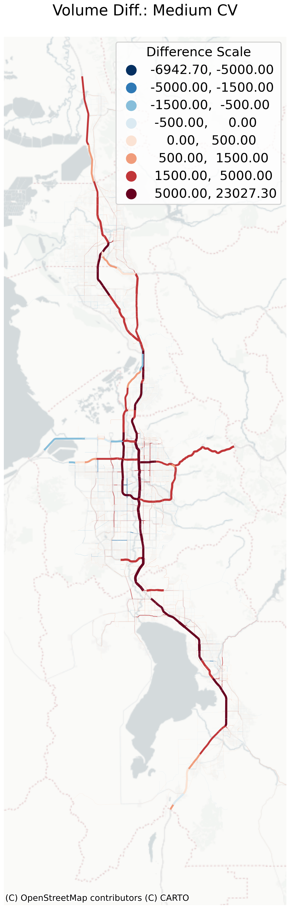
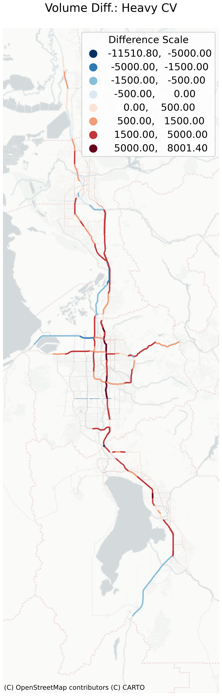

```{python}
# ==============================================================================
# CONFIGURATION
# ==============================================================================
from pathlib import Path
import pandas as pd
import geopandas as gpd
import numpy as np
import matplotlib.pyplot as plt
import contextily as ctx
import _validation_scripts as vs
import openmatrix as omx
import geopandas as gpd
from shapely.geometry import Point
import math
import glob
import os
import json
import openpyxl
```

```{python}
repo_root = Path("..")
calib_runs = vs.list_available_runs(repo_root)

# static reference / shared observed paths (not run-specific) -- per-run
# filenames (Summary_SEGID(_Detailed).csv, carrying a Cube-generated
# `___{runId}___` prefix -- see 3-modechoice.qmd's note) are resolved inside
# the per-run loader functions below, against each run's own outputs_dir
config_paths = {
    "taz_shp": r"data/4-assignhwy/taz/WFv1000_TAZ.shp",
    "geojson_file": r"data/4-assignhwy/taz/tazv10.geojson",
    "path_in_region": r"data/4-assignhwy/RegionalBoundary.gpkg",
    "path_in_segments": r"data/4-assignhwy/seg_shp/WFv1000_Segments.shp",
    "path_in_ccs_counts": r"data/4-assignhwy/UDOT_VehicleClassificationCounts/JKLP_Length_WFRC_2023_Sept_Nov.csv",
    "path_in_ccs_split_factors": r"data/4-assignhwy/UDOT_VehicleClassificationCounts/LT_MD_HV_Split_Factors_2025.csv",
    "path_in_ccs_reclass_ratio": r"data/4-assignhwy/UDOT_VehicleClassificationCounts/CCS_Reclass_Ratio_2025_2003.csv",
    "path_in_ccs_daily": r"../inputs/CCS_Observed_Counts_Raw.csv",
    "path_in_ccs_locations": r"data/4-assignhwy/UDOT_VehicleClassificationCounts/SiteData.csv",
    "google_speeds_mag": r"data/4-assignhwy/google-api-speeds/MAG/both_time_*_2023.csv",
    "google_speeds_wfrc": r"data/4-assignhwy/google-api-speeds/WFRC/both_time_*_2023.csv",
    "ccs_lanes1": r"../inputs/2023 Station 301-431.xlsx",
    "ccs_lanes2": r"../inputs/2023 Station 501-733.xlsx",
}
```

```{python}
# read segment shapefile into spatial enabled dataframe
segShp = gpd.read_file(
    config_paths["path_in_segments"],
    include_fields=[
        "SEGID",
        "DISTANCE",
        "AADT2023",
        "FAC_WDAVG",
        "SUTRUCKS",
        "CUTRUCKS",
        "CO_FIPS",
        "FTCLASS",
        "geometry",
    ],
)

# create folder if missing
if not os.path.exists("intermediate"):
    os.makedirs("intermediate")
if not os.path.exists("_pictures"):
    os.makedirs("_pictures")
```

```{python}
# | label: ccs-filepaths

# Refer to the following Repo for detailed analysis: https://github.com/WFRCAnalytics/TDM-VAL-TrafficVolume-CCS/
CRS_UTM = 26912  # NAD83 / UTM zone 12N
```

```{python}
# convert taz shp to geojson if it doesn't exist
if not Path(config_paths['geojson_file']).exists():
    gdf = gpd.read_file(config_paths['taz_shp'])

    # make sure the shapefile has the correct CRS
    if gdf.crs is None:
        gdf = gdf.set_crs(epsg=26912)

    # 🔑 reproject to lat/lon
    gdf = gdf.to_crs(epsg=4326)

    gdf.to_file(config_paths['geojson_file'], driver="GeoJSON")
```


## Volume Validation

### Observed Traffic Counts (CCS)

```{python}
# | label: ccs-region

# Load and Project
gdf_region = (
    gpd.read_file(
        config_paths["path_in_region"],
        layer="RegionalBoundaryComponents",
        where="PlanOrg IN ('MAG MPO', 'WFRC MPO')",
    )
    .dissolve()
    .to_crs(CRS_UTM)
)

# Fix the holes and slivers
gdf_region["geometry"] = (
    gdf_region.buffer(1).buffer(-1).buffer(16093.4)
)  # 10 miles buffer to capture stations just outside county boundaries
```

```{python}
# | label: ccs-segments

gdf_segments = gpd.read_file(config_paths['path_in_segments']).to_crs(CRS_UTM)

# Ensure SEGID is string for consistent matching
gdf_segments["SEGID"] = gdf_segments["SEGID"].astype(str)

# Parse Route and Milepost from SEGID directly (Independent of Model Results)
temp_route = gdf_segments["SEGID"].str.split("_").str[0]
gdf_segments["MODEL_ROUTE"] = pd.to_numeric(temp_route, errors="coerce")
gdf_segments["MODEL_MP"] = gdf_segments["SEGID"].str.split("_").str[1].astype(float)

# Filter to valid network links for matching
gdf_network_clean = gdf_segments.dropna(subset=["MODEL_ROUTE", "MODEL_MP"]).copy()
gdf_network_clean["MODEL_ROUTE"] = gdf_network_clean["MODEL_ROUTE"].astype(int)
```

```{python}
# | label: ccs-locations

# Read Count Site data and convert it to geodataframe using Lat/Long
df_sites = pd.read_csv(config_paths["path_in_ccs_locations"])
gdf_ccs_locations = (
    gpd.GeoDataFrame(
        df_sites,
        geometry=gpd.points_from_xy(df_sites.LONGITUDE, df_sites.LATITUDE),
        crs="EPSG:4326",
    )
    .to_crs(CRS_UTM)
    .clip(gdf_region)
)

# Ensure SITE is string and ROUTE/MP are numeric for matching
gdf_ccs_locations["SITE"] = gdf_ccs_locations["SITE"].astype(str)
gdf_ccs_locations["ROUTE"] = (
    pd.to_numeric(gdf_ccs_locations["ROUTE"], errors="coerce").fillna(0).astype(int)
)
gdf_ccs_locations["MILEPOST"] = pd.to_numeric(
    gdf_ccs_locations["MILEPOST"], errors="coerce"
)
```

```{python}
# | label: ccs-spatial-join

# Prepare Network Data
gdf_net_join = gdf_network_clean.copy()

# Ensure matching columns are numeric
gdf_net_join["MODEL_ROUTE"] = (
    pd.to_numeric(gdf_net_join["MODEL_ROUTE"], errors="coerce").fillna(0).astype(int)
)
gdf_net_join["BMP"] = pd.to_numeric(gdf_net_join["BMP"], errors="coerce")
gdf_net_join["EMP"] = pd.to_numeric(gdf_net_join["EMP"], errors="coerce")

match_results = []

# --- 2. Execute 3-Step Match ---
for idx, row in gdf_ccs_locations.iterrows():
    # Use default column names
    site_id = row["SITE"]
    route = row["ROUTE"]
    mp = row["MILEPOST"]
    geom = row["geometry"]

    matched_segid = None
    match_type = "None"

    # Filter Network by Route
    if route > 0:
        route_segs = gdf_net_join[gdf_net_join["MODEL_ROUTE"] == route]
    else:
        route_segs = pd.DataFrame()

    if not route_segs.empty:
        # --- PRIORITY 1: Milepost Match (BMP <= MP <= EMP) ---
        # Buffer slightly (e.g. 0.001) to handle edge cases
        mp_match = route_segs[
            (route_segs["BMP"] <= mp + 0.001) & (route_segs["EMP"] >= mp - 0.001)
        ]

        if not mp_match.empty:
            # If multiple segments cover this MP (rare), take closest geometry
            matched_segid = mp_match.loc[mp_match.distance(geom).idxmin(), "SEGID"]
            match_type = "1. Route + MP Match"

        # --- PRIORITY 2: Route Nearest (Fallback) ---
        elif matched_segid is None:
            matched_segid = gdf_net_join.loc[gdf_net_join.distance(geom).idxmin(), "SEGID"]
            match_type = "3. Global Nearest (Fallback)"

    # --- PRIORITY 3: Global Nearest (Fallback) ---
    elif matched_segid is None:
        matched_segid = route_segs.loc[route_segs.distance(geom).idxmin(), "SEGID"]
        match_type = "3. Global Nearest (Fallback)"

    match_results.append(
        {"SITE": site_id, "MATCHED_SEGID": matched_segid, "MATCH_TYPE": match_type}
    )

# Create Bridge DataFrame
df_bridge = pd.DataFrame(match_results)

# Append Context (County Name) directly from Network
fips_map = {3: "Box Elder", 11: "Davis", 35: "Salt Lake", 49: "Utah", 57: "Weber"}
df_bridge = df_bridge.merge(
    gdf_network_clean[["SEGID", "CO_FIPS"]].assign(
        COUNTY_NAME=lambda x: x["CO_FIPS"].map(fips_map).fillna("Other")
    ),
    left_on="MATCHED_SEGID",
    right_on="SEGID",
    how="left",
).drop(columns=["SEGID", "CO_FIPS"])
```

```{python}
# | label: ccs-manual-override

# Manual Override: Fix Station -680 to since it doesnt incoporate entire freeway
df_bridge = df_bridge[~df_bridge["SITE"].isin(["-680"])]

# Manual Override: Remove Ramp/Interchange stations (-816, -302)
df_bridge = df_bridge[~df_bridge["SITE"].isin(["-816", "-302"])]

# Manual Override: Remove station -664 with odd data, only 107 AADT
df_bridge = df_bridge[~df_bridge["SITE"].isin(["-664"])]
```

```{python}
# | label: ccs-process-observed

# --- 1. Load & Clean Raw Data ---
df_obs_clean = (
    pd.read_csv(config_paths["path_in_ccs_counts"])
    .assign(
        SITE=lambda x: x["SITE"].astype(str),
        DATE_ONLY=lambda x: pd.to_datetime(x["DATE_ONLY"]),
    )
    # Filter: Tue(1), Wed(2), Thu(3)
    .loc[lambda x: x["DATE_ONLY"].dt.dayofweek.isin([1, 2, 3])]
    .assign(
        PERIOD=lambda x: np.select(
            [
                (x.HOUR >= 6) & (x.HOUR < 9),
                (x.HOUR >= 9) & (x.HOUR < 15),
                (x.HOUR >= 15) & (x.HOUR < 18),
            ],
            ["AM", "MD", "PM"],
            default="EV",
        )
    )
)

# --- 2. Apply Vehicle Splits ---
# Load splits (rows=Class, cols=Components)
splits = (
    pd.read_csv(config_paths["path_in_ccs_split_factors"])
    .set_index("Length Bin")[["LT", "MD", "HV"]]
    .div(100)
    .fillna(0)
)

# Merge splits and calculate weighted counts
df_obs_split = df_obs_clean.merge(
    splits, left_on="LENGTH_DEF", right_index=True, how="left"
)
for col in ["LT", "MD", "HV"]:
    df_obs_split[col] = df_obs_split["COUNT"] * df_obs_split[col]

# --- 3. Aggregation Pipeline ---
df_obs_tidy = (
    df_obs_split
    # A. Sum Hourly -> Daily Total (per Site/Date/Period)
    .groupby(["SITE", "DATE_ONLY", "PERIOD"])[["LT", "MD", "HV"]]
    .sum()
    .reset_index()
    # B. Mean Daily -> Average Volume (per Site/Period)
    .groupby(["SITE", "PERIOD"])[["LT", "MD", "HV"]]
    .mean()
    .reset_index()
    # C. Melt -> Tidy Format
    .melt(id_vars=["SITE", "PERIOD"], var_name="TYPE_RAW", value_name="OBSERVED")
    .assign(
        VEHICLE_TYPE=lambda x: x["TYPE_RAW"].map(
            {"LT": "Auto", "MD": "SUT", "HV": "CUT"}
        )
    )
    .drop(columns=["TYPE_RAW"])
)
```

```{python}
# | label: ccs-process-model

periods = ["AM", "MD", "PM", "EV"]

def _load_mod_tidy(calib_run, outputs_dir):
    # --- 1. Load Model Data ---
    df_mod_summary = pd.read_csv(vs.find_one(outputs_dir, "*Summary_SEGID.csv"))

    # Filter for Bi-Directional ("Both") and Functional Group ("Total")
    df_mod_clean = df_mod_summary[
        (df_mod_summary["DIRECTION"] == "Both")
        & (df_mod_summary["FUNCGROUP"] == "Total")
        & (df_mod_summary["SEGID"].isin(df_bridge["MATCHED_SEGID"].unique()))
    ].copy()
    df_mod_clean["SEGID"] = df_mod_clean["SEGID"].astype(str)

    # --- 2. Calculate Vehicle Groups (Detailed) ---
    # Auto = PC + LT (Model Light CV), SUT = MD, CUT = HV
    melt_vars = []
    for p in periods:
        df_mod_clean[f"{p}_Vol_Auto"] = (
            df_mod_clean[f"{p}_Vol_PC"] + df_mod_clean[f"{p}_Vol_LT"]
        )
        df_mod_clean[f"{p}_Vol_SUT"] = df_mod_clean[f"{p}_Vol_MD"]
        df_mod_clean[f"{p}_Vol_CUT"] = df_mod_clean[f"{p}_Vol_HV"]
        melt_vars.extend([f"{p}_Vol_Auto", f"{p}_Vol_SUT", f"{p}_Vol_CUT"])

    # --- 3. Tidy: Melt to Long Format ---
    df_tidy = df_mod_clean.melt(
        id_vars=["SEGID", "FTCLASS", "ATYPENAME"],
        value_vars=melt_vars,
        var_name="Metric",
        value_name="MODELED",
    )
    df_tidy[["PERIOD", "_", "VEHICLE_TYPE"]] = df_tidy["Metric"].str.split("_", expand=True)
    return df_tidy.drop(columns=["Metric", "_"])

df_mod_tidy = vs.load_per_run(repo_root, _load_mod_tidy)
```

```{python}
# | label: ccs-merge

# --- 1. Map Observed to Bridge ---
# df_bridge comes from the earlier 'ccs-bridge' chunk
df_merged_obs = df_obs_tidy.merge(
    df_bridge,
    on="SITE",
    how="inner",
)

# --- 2. AGGREGATION: Sum Observed by Segment ---
# This step combines multiple sites (e.g., -675, -676) into one record per segment
df_obs_by_segment = (
    df_merged_obs.groupby(["MATCHED_SEGID", "COUNTY_NAME", "PERIOD", "VEHICLE_TYPE"])
    .agg(
        {
            "OBSERVED": "sum",
            "SITE": lambda x: ",".join(
                sorted(x.unique())
            ),  # Create string list e.g. "-675,-676"
        }
    )
    .reset_index()
)

# --- 6. Final Join: Model + Observed (at Segment Level) ---
df_final = pd.merge(
    df_obs_by_segment,
    df_mod_tidy,
    left_on=["MATCHED_SEGID", "PERIOD", "VEHICLE_TYPE"],
    right_on=["SEGID", "PERIOD", "VEHICLE_TYPE"],
    how="inner",
)

# Select and Order Columns for Dashboard
df_final = df_final[
    [
        "SITE",
        "MATCHED_SEGID",
        "FTCLASS",
        "ATYPENAME",
        "COUNTY_NAME",
        "PERIOD",
        "VEHICLE_TYPE",
        "OBSERVED",
        "MODELED",
        "calib_run",
    ]
].copy()

# Add Calc Columns for CSV export
df_final["DIFF"] = df_final["MODELED"] - df_final["OBSERVED"]
# Handle division by zero for CSV readability
df_final["PCT_DIFF"] = np.where(
    df_final["OBSERVED"] > 0, df_final["DIFF"] / df_final["OBSERVED"], 0
).round(3)
```

```{python}
# ======================================================================
# CROSS-RUN COMPARISON: emit headline metrics for report/compare.qmd
# one file per calibration run
# ======================================================================
for _calib_run in calib_runs:
    _df_run = df_final[df_final["calib_run"] == _calib_run]
    _obs_total = _df_run["OBSERVED"].sum()
    _mod_total = _df_run["MODELED"].sum()
    _rmse = ((_df_run["MODELED"] - _df_run["OBSERVED"]) ** 2).mean() ** 0.5

    _summary_metrics = {
        "calib_run": _calib_run,
        "stage": "assignhwy",
        "metrics": {
            "total_observed_volume": float(_obs_total),
            "total_modeled_volume": float(_mod_total),
            "total_pct_diff": float((_mod_total - _obs_total) / _obs_total) if _obs_total else None,
            "segment_rmse": float(_rmse),
        },
    }
    with open(f"summary_metrics_assignhwy_{_calib_run}.json", "w") as f:
        json.dump(_summary_metrics, f, indent=2)
```

```{python}
# | label: ccs-export-geojson

# Only export if files don't exist (or overwrite if needed)
valid_segids = set(df_final["MATCHED_SEGID"])

# 1. Dashboard Data
# We pass the DataFrame directly. Quarto will serialize this efficiently (column-oriented).
# We will handle the transposition (to row-oriented) in OJS.
dash_data_export = df_final

# 2. Segments Geometry
# Use __geo_interface__ to create the standard GeoJSON dictionary structure.
gdf_seg_out = gdf_network_clean[gdf_network_clean["SEGID"].isin(valid_segids)].to_crs(
    "EPSG:4326"
)
segments_export = gdf_seg_out.__geo_interface__

# 3. Stations Geometry
relevant_sites = df_bridge[df_bridge["MATCHED_SEGID"].isin(valid_segids)]

gdf_stn_out = gdf_ccs_locations.merge(
    relevant_sites[["SITE", "MATCHED_SEGID"]], on="SITE", how="inner"
).to_crs("EPSG:4326")

stations_export = gdf_stn_out.__geo_interface__

# 4. Define OJS Variables
# These variables will be available in the OJS runtime
ojs_define(
    data_py=dash_data_export, segments_py=segments_export, stations_py=stations_export
)
```

```{ojs}
//| label: ojs-dashboard
//| echo: false

// 1. IMPORT LIBRARIES
import { aq, op } from '@uwdata/arquero'
import { Plot } from '@observablehq/plot'

// 2. LOAD DATA
// Use transpose() to convert the column-oriented Python data to row-oriented objects
data_raw = transpose(data_py)

// 3. DASHBOARD CONTROLS
viewof dashboard_ctrls = {
  const form = Inputs.form({
    calib_run: Inputs.select(
      Array.from(new Set(data_raw.map(d => d.calib_run))).sort(),
      {label: "Calibration Run:", value: Array.from(new Set(data_raw.map(d => d.calib_run))).sort().at(-1)}
    ),

    group_by: Inputs.select(
      new Map([
        ["Functional Class", "FTCLASS"],
        ["Area Type", "ATYPENAME"],
        ["County", "COUNTY_NAME"],
        ["Time Period", "PERIOD"],
        ["Vehicle Type", "VEHICLE_TYPE"]
      ]),
      {label: "Group Vars:", value: "FTCLASS"}
    ),

    filter_county: Inputs.select(
      ["All"].concat(Array.from(new Set(data_raw.map(d => d.COUNTY_NAME))).sort()),
      {label: "County:", value: "All"}
    ),

    filter_ftclass: Inputs.select(
      ["All"].concat(Array.from(new Set(data_raw.map(d => d.FTCLASS))).sort()),
      {label: "Functional Class:", value: "All"}
    ),

    filter_atype: Inputs.select(
      ["All"].concat(Array.from(new Set(data_raw.map(d => d.ATYPENAME))).sort()),
      {label: "Area Type:", value: "All"}
    ),

    filter_period: Inputs.select(
      new Map([
        ["All Periods", "All"],
        ["AM Peak", "AM"],
        ["Midday", "MD"],
        ["PM Peak", "PM"],
        ["Evening", "EV"]
      ]),
      {label: "Period:", value: "All"}
    ),

    filter_vehicle: Inputs.select(
      new Map([
        ["All Vehicles", "All"],
        ["Autos", "Auto"],
        ["Single Unit Truck (SUT)", "SUT"],
        ["Combination Unit Truck (CUT)", "CUT"]
      ]),
      {label: "Vehicle:", value: "All"}
    )
  });

  form.style.display = "grid";
  form.style.gridTemplateColumns = "repeat(auto-fit, minmax(250px, 1fr))";
  form.style.gap = "10px";
  form.style.alignItems = "flex-end";
  form.style.marginBottom = "20px";

  return form;
}

// 4. DATA PROCESSING
dash_data = {
  const { calib_run, group_by, filter_county, filter_ftclass, filter_atype, filter_period, filter_vehicle } = dashboard_ctrls;

  let base = aq.from(data_raw)
    .params({
      cr: calib_run,
      fc: filter_county,
      ff: filter_ftclass,
      fa: filter_atype,
      fp: filter_period,
      fv: filter_vehicle,
      gb: group_by
    })
    .filter((d, $) => d.calib_run === $.cr)
    .filter((d, $) => $.fc === "All" || d.COUNTY_NAME === $.fc)
    .filter((d, $) => $.ff === "All" || d.FTCLASS === $.ff)
    .filter((d, $) => $.fa === "All" || d.ATYPENAME === $.fa)
    .filter((d, $) => $.fp === "All" || d.PERIOD === $.fp)
    .filter((d, $) => $.fv === "All" || d.VEHICLE_TYPE === $.fv)

  // A. Scatter Data (Station Level)
  // Aggregating by MATCHED_SEGID ensures one point per segment per grouping
  let scatter = base
    .groupby( "MATCHED_SEGID", group_by)
    .rollup({
      Stations: op.any("SITE"),
      Obs_Total: op.sum('OBSERVED'),
      Mod_Total: op.sum('MODELED')
    })
    .derive({
      Label: (d, $) => d[$.gb],
      Obs_K: d => d.Obs_Total / 1000,
      Mod_K: d => d.Mod_Total / 1000,
      Pct_Error: d => d.Obs_Total > 0 ? (d.Mod_Total - d.Obs_Total) / d.Obs_Total : 0
    })

  // B. Summary Data (Aggregate Level)
  let summary_base = base
    .groupby(group_by)
    .rollup({
      Segments: op.count(),
      Stations: op.distinct('SITE'),
      Obs_Total: op.sum('OBSERVED'),
      Mod_Total: op.sum('MODELED'),
      Diff_Sq_Sum: d => op.sum(op.pow(d.MODELED - d.OBSERVED, 2))
    });

  let total_row = base
    .rollup({
      Segments: op.count(),
      Stations: op.distinct('SITE'),
      Obs_Total: op.sum('OBSERVED'),
      Mod_Total: op.sum('MODELED'),
      Diff_Sq_Sum: d => op.sum(op.pow(d.MODELED - d.OBSERVED, 2))
    })
    .derive({ [group_by]: d => "TOTAL" });

  // Define custom sort orders
  const sort_orders = {
    'FTCLASS': ['Freeway', 'Expressway', 'Principal Arterial', 'Minor Arterial', 'Collector'],
    'ATYPENAME': ['Urban', 'Suburban', 'Transition', 'Rural'],
    'COUNTY_NAME': ['Box Elder', 'Weber', 'Davis', 'Salt Lake', 'Utah'],
    'PERIOD': ['AM', 'MD', 'PM', 'EV'],
    'VEHICLE_TYPE': ['Auto', 'SUT', 'CUT']
  };

  let summary = summary_base
    .derive({
      Difference: d => d.Mod_Total - d.Obs_Total,
      Percent_Difference: d => (d.Mod_Total - d.Obs_Total) / d.Obs_Total,
      RMSE: d => Math.sqrt(d.Diff_Sq_Sum / d.Segments),
      Percent_RMSE: d => d.Obs_Total > 0 ? Math.sqrt(d.Diff_Sq_Sum / d.Segments) / (d.Obs_Total / d.Segments) : 0,
      Label: (d, $) => d[$.gb]
    })
    .concat(total_row.derive({
      Difference: d => d.Mod_Total - d.Obs_Total,
      Percent_Difference: d => (d.Mod_Total - d.Obs_Total) / d.Obs_Total,
      RMSE: d => Math.sqrt(d.Diff_Sq_Sum / d.Segments),
      Percent_RMSE: d => d.Obs_Total > 0 ? Math.sqrt(d.Diff_Sq_Sum / d.Segments) / (d.Obs_Total / d.Segments) : 0,
      Label: (d, $) => d[$.gb]
    }));

  // Apply custom sorting
  const order = sort_orders[group_by] || [];
  if (order.length > 0) {
    // Convert to array, sort, then back to arquero table
    let summary_array = summary.objects();
    summary_array.sort((a, b) => {
      if (a.Label === "TOTAL") return 1;
      if (b.Label === "TOTAL") return -1;
      const aIndex = order.indexOf(a.Label);
      const bIndex = order.indexOf(b.Label);
      const aOrder = aIndex >= 0 ? aIndex : 999;
      const bOrder = bIndex >= 0 ? bIndex : 999;
      return aOrder - bOrder;
    });
    summary = aq.from(summary_array);
  } else {
    // Just ensure TOTAL is at the end
    let summary_array = summary.objects();
    summary_array.sort((a, b) => {
      if (a.Label === "TOTAL") return 1;
      if (b.Label === "TOTAL") return -1;
      return 0;
    });
    summary = aq.from(summary_array);
  }

  return { scatter, summary }
}

// 5. HELPER: TRENDLINES DATA
trendlines = {
  const max_k = dash_data.scatter.rollup({ max: op.max("Mod_K") }).get("max") || 1;
  const lines = [
    { slope: 1.4, label: "+40%" },
    { slope: 1.3, label: "+30%" },
    { slope: 1.2, label: "+20%" },
    { slope: 1.1, label: "+10%" },
    { slope: 1.0, label: "Equal" },
    { slope: 0.9, label: "-10%" },
    { slope: 0.8, label: "-20%" },
    { slope: 0.7, label: "-30%" },
    { slope: 0.6, label: "-40%" }
  ];
  return lines.flatMap(l => [
    { x: 0, y: 0, label: l.label, slope: l.slope },
    { x: max_k, y: max_k * l.slope, label: l.label, slope: l.slope }
  ]);
}

// 6. HELPER: ERROR BOUNDS
error_bounds = {
  const max_k = dash_data.scatter.rollup({ max: op.max("Obs_K") }).get("max") || 1;
  const bounds = [
    { x: 0, y_pos: 2.0, y_neg: -2.0 },
    { x: 1, y_pos: 2.0, y_neg: -2.0 },
    { x: 1, y_pos: 1.0, y_neg: -1.0 },
    { x: 2.5, y_pos: 1.0, y_neg: -1.0 },
    { x: 2.5, y_pos: 0.5, y_neg: -0.5 },
    { x: 5, y_pos: 0.5, y_neg: -0.5 },
    { x: 5, y_pos: 0.25, y_neg: -0.25 },
    { x: 10, y_pos: 0.25, y_neg: -0.25 },
    { x: 10, y_pos: 0.20, y_neg: -0.20 },
    { x: 25, y_pos: 0.20, y_neg: -0.20 },
    { x: 25, y_pos: 0.15, y_neg: -0.15 },
    { x: 50, y_pos: 0.15, y_neg: -0.15 },
    { x: 50, y_pos: 0.10, y_neg: -0.10 },
    { x: Math.max(max_k, 250), y_pos: 0.10, y_neg: -0.10 }
  ];
  return bounds;
}

// 7. HELPER: Color-blind friendly palette (Okabe-Ito)
palette = ["#E69F00", "#56B4E9", "#009E73", "#CC79A7", "#0072B2", "#D55E00", "#F0E442", "#999999"]
```

::: {.panel-tabset}

###### Model vs Observed Volumes (000s)

```{ojs}
// 7. VISUALIZATION
// md`#### 1. Model vs Observed Volumes (000s)`

max_obs_k = dash_data.scatter.rollup({ max: op.max("Obs_K") }).get("max") || 1
max_mod_k = dash_data.scatter.rollup({ max: op.max("Mod_K") }).get("max") || 1
max_vol_k = Math.max(max_obs_k, max_mod_k)

Plot.plot({
  height: 400,
  aspectRatio: 1,
  grid: true,
  x: { label: "Observed Volume (000s)", domain: [0, max_vol_k * 1.05] },
  y: { label: "Modeled Volume (000s)", domain: [0, max_vol_k * 1.05]  },
  style: { backgroundColor: 'transparent' },
  color: { legend: true, label: dashboard_ctrls.group_by, range: palette },
  marks: [
    Plot.line(trendlines, {
      x: "x", y: "y", z: "slope",
      stroke: "currentColor", strokeOpacity: 0.2, strokeDasharray: "4"
    }),
    Plot.text(trendlines.filter(d => d.x > 0), {
      x: "x", y: "y", text: "label",
      dx: 5, fill: "currentColor", fillOpacity: 0.5, textAnchor: "start"
    }),
    Plot.line(trendlines.filter(d => d.slope === 1.0), {
      x: "x", y: "y", stroke: "currentColor", strokeOpacity: 0.5, strokeWidth: 1.5
    }),
    Plot.linearRegressionY(dash_data.scatter, {
      x: "Obs_K", y: "Mod_K", stroke: "rgb(80, 116, 230)",
      strokeDasharray: "4 4", strokeWidth: 2
    }),
    Plot.dot(dash_data.scatter, {
      x: "Obs_K", y: "Mod_K", fill: "Label",
      stroke: "white", strokeOpacity: 0.5, r: 4,
      title: d => `Station: ${d.Stations}\nGroup: ${d.Label}\nObs: ${d.Obs_Total.toLocaleString()}\nMod: ${d.Mod_Total.toLocaleString()}\nError: ${(d.Pct_Error*100).toFixed(1)}%`
    })
  ]
})
```

###### Model vs Observed Percent Error

```{ojs}
// md`#### 2. Model vs Observed Percent Error`

Plot.plot({
  height: 400,
  grid: true,
  x: { label: "Observed Volume (000s)", domain: [0, max_obs_k * 1.05] },
  y: { label: "Percent Error", tickFormat: "+%", domain: [-2, 2] },
  style: { backgroundColor: 'transparent' },
  color: { legend: true, label: dashboard_ctrls.group_by, range: palette },
  marks: [
    Plot.ruleY([0], { stroke: "currentColor", strokeWidth: 1.5, strokeOpacity: 0.5 }),
    Plot.line(error_bounds, { x: "x", y: "y_pos", stroke: "gray", strokeWidth: 2, strokeOpacity: 0.4 }),
    Plot.line(error_bounds, { x: "x", y: "y_neg", stroke: "gray", strokeWidth: 2, strokeOpacity: 0.4 }),
    Plot.dot(dash_data.scatter, {
      x: "Obs_K", y: "Pct_Error", fill: "Label",
      stroke: "white", strokeOpacity: 0.5, r: 4,
      title: d => `Station: ${d.Stations}\nObs: ${d.Obs_Total.toLocaleString()}\nError: ${(d.Pct_Error*100).toFixed(1)}%`
    })
  ]
})
```

###### Aggregate Comparison & Statistics

```{ojs}
// md`#### 3. Aggregate Comparison & Statistics`

bar_data = dash_data.summary.fold(["Obs_Total", "Mod_Total"], { as: ["Metric", "Volume"] })
    .derive({ Metric_Label: d => d.Metric === "Obs_Total" ? "Observed" : "Modeled" })

Plot.plot({
  marginLeft: 80,
  height: Math.max(400, dash_data.summary.numRows() * 40),
  color: { domain: ["Observed", "Modeled"], range: ["#77933c", "#376092"], legend: true, label: "Data Source" },
  style: { backgroundColor: 'transparent' },
  x: { label: "Total Volume", grid: true, tickFormat: "s" },
  y: { axis: null },
  fy: { label: null, axis: "left" },
  marks: [
    Plot.barX(bar_data, {
      x: "Volume", y: "Metric_Label", fy: "Label", fill: "Metric_Label",
      title: d => `${d.Metric_Label}: ${d.Volume.toLocaleString()}`,
      sort: { fy: "x", reduce: "max", order: "descending" }
    }),
    Plot.text(bar_data, {
      x: "Volume", y: "Metric_Label", fy: "Label",
      text: d => d.Volume.toLocaleString(),
      dx: 5, textAnchor: "start", fill: "currentColor", fontSize: 10
    })
  ]
})
```

###### Interactive Mapping

```{ojs}
// md`#### 4. Interactive Mapping`

// 1. IMPORT LEAFLET
L = require("leaflet@1.9.4")
html`<link rel="stylesheet" href="https://unpkg.com/leaflet@1.9.4/dist/leaflet.css">`

// 2. LOAD GEOMETRY
// Directly reference the variables defined in Python
stations_geo = stations_py
segments_geo = segments_py

// 3. DRAW REACTIVE MAP
map_display = {
  // A. PREPARE DATA
  const scatter_array = dash_data.scatter.objects();

  // Create Lookup Map: MATCHED_SEGID -> Data Object
  const data_map = new Map(scatter_array.map(d => [String(d.MATCHED_SEGID).trim(), d]));

  // Valid IDs sets for filtering geometry
  const valid_seg_ids = new Set(data_map.keys());

  // --- COLOR LOGIC ---
  const current_group = dashboard_ctrls.group_by;
  const enable_color = ["FTCLASS", "ATYPENAME", "COUNTY_NAME"].includes(current_group);
  const unique_labels = Array.from(new Set(scatter_array.map(d => d.Label))).sort();
  const color_map = new Map(unique_labels.map((l, i) => [l, palette[i % palette.length]]));

  // B. SETUP CONTAINER
  const container = document.createElement("div");
  container.style.height = "650px";
  container.style.width = "100%";
  container.style.borderRadius = "8px";
  container.style.border = "1px solid #ccc";
  container.style.zIndex = "1";

  // C. INITIALIZE MAP
  const map = L.map(container).setView([40.7608, -111.8910], 9);
  L.tileLayer('https://{s}.basemaps.cartocdn.com/rastertiles/voyager/{z}/{x}/{y}{r}.png', {
    attribution: '&copy; OpenStreetMap &copy; CARTO',
    maxZoom: 19
  }).addTo(map);

  // --- HELPER FUNCTIONS ---
  function highlightSegment(segid) {
    if (!segid) return;
    const clean_segid = String(segid).trim();
    segmentLayer.eachLayer(layer => {
      if (layer._segid === clean_segid) {
        layer.setStyle({ color: "#00e5ff", weight: 8, opacity: 1.0 });
        layer.bringToFront();
      }
    });
  }

  function highlightStations(segid) {
    if (!segid) return;
    const clean_segid = String(segid).trim();
    stationLayer.eachLayer(layer => {
      if (layer._matched_segid === clean_segid) {
        // Use setRadius for the size increase
        layer.setRadius(6);
        layer.setStyle({
          color: "#00e5ff",
          weight: 3,
          fillColor: "#00e5ff",
          fillOpacity: 1.0
        });
        layer.bringToFront();
      }
    });
  }

  function resetAll() {
    segmentLayer.eachLayer(l => segmentLayer.resetStyle(l));
    stationLayer.eachLayer(l => {
      stationLayer.resetStyle(l);
      // Explicitly reset the radius to your default of 4
      if (typeof l.setRadius === "function") {
        l.setRadius(4);
      }
    });
  }

  // D. ADD SEGMENTS
  const filtered_segments = {
    type: "FeatureCollection",
    features: segments_geo.features.filter(f => f.properties.SEGID && valid_seg_ids.has(String(f.properties.SEGID).trim()))
  };

  const segmentLayer = L.geoJSON(filtered_segments, {
    style: (feature) => {
      const segid = String(feature.properties.SEGID).trim();
      const stats = data_map.get(segid);
      let finalColor = "#376092";
      if (enable_color && stats) finalColor = color_map.get(stats.Label) || finalColor;
      return { color: finalColor, weight: 4, opacity: 0.9 };
    },
    onEachFeature: (feature, layer) => {
      const segid = String(feature.properties.SEGID).trim();
      layer._segid = segid;

      const stats = data_map.get(segid);
      const group_label = stats ? stats.Label : "N/A";
      const stations_label = stats ? stats.Stations : "N/A";

      layer.bindPopup(`<div style="font-family:sans-serif; font-size:12px;"><b>Segment: ${segid}</b><br>Group: ${group_label}<br>Stations: ${stations_label}</div>`);

      layer.on('mouseover', () => {
         resetAll();
         layer.setStyle({ color: "#00e5ff", weight: 4, opacity: 1.0 });
         layer.bringToFront();
         highlightStations(segid);
      });
      layer.on('mouseout', () => resetAll());
    }
  }).addTo(map);

  // E. ADD STATIONS
  const filtered_sites = {
    type: "FeatureCollection",
    features: stations_geo.features.filter(f => f.properties.MATCHED_SEGID && valid_seg_ids.has(String(f.properties.MATCHED_SEGID).trim()))
  };

  const stationLayer = L.geoJSON(filtered_sites, {
    pointToLayer: (feature, latlng) => {
      // Look up stats using MATCHED_SEGID from GeoJSON
      const segid = String(feature.properties.MATCHED_SEGID).trim();
      const stats = data_map.get(segid);

      let finalColor = "#77933c";
      if (enable_color && stats) finalColor = color_map.get(stats.Label) || finalColor;

      return L.circleMarker(latlng, { radius: 4, fillColor: finalColor, color: "#1e1e1e", weight: 1, opacity: 0.9, fillOpacity: 0.9 });
    },
    onEachFeature: (feature, layer) => {
      const site_id = String(feature.properties.SITE).trim();
      const segid = String(feature.properties.MATCHED_SEGID).trim();
      layer._site_id = site_id;
      layer._matched_segid = segid;

      const stats = data_map.get(segid);

      layer.on('mouseover', () => {
         resetAll();
         if (segid) highlightSegment(segid);
      });
      layer.on('mouseout', () => resetAll());

      if (stats) {
        const diffColor = stats.Pct_Error > 0 ? '#d9534f' : '#5cb85c';
        layer.bindPopup(`<div style="font-family: sans-serif; min-width: 160px;">
         <strong>Station(s): ${stats.Stations}</strong><hr style="margin:4px 0; border:0; border-top:1px solid #eee;">
         Group: <b>${stats.Label}</b><br/>
         Observed: <b>${Math.round(stats.Obs_Total).toLocaleString()}</b><br/>
         Modeled: ${Math.round(stats.Mod_Total).toLocaleString()}<br/>
         Diff: <span style="color:${diffColor}; font-weight:bold;">${(stats.Pct_Error * 100).toFixed(1)}%</span><br/>
         <span style="color:#999; font-size:11px;">Seg: ${segid}</span>
         <br/><span style="color:#999; font-size:10px;">(This dot: Site ${site_id})</span>
         </div>`);
      }
    }
  }).addTo(map);

  // F. ADD LEGEND
  if (enable_color && unique_labels.length > 0) {
    const legend = L.control({ position: 'bottomright' });

    legend.onAdd = function(map) {
      const div = L.DomUtil.create('div', 'info legend');
      div.style.backgroundColor = 'white';
      div.style.padding = '10px';
      div.style.borderRadius = '5px';
      div.style.boxShadow = '0 0 15px rgba(0,0,0,0.2)';
      div.style.fontSize = '12px';
      div.style.lineHeight = '18px';

      // Add title
      const title_text = current_group === 'FTCLASS' ? 'Functional Class' :
                         current_group === 'ATYPENAME' ? 'Area Type' :
                         current_group === 'COUNTY_NAME' ? 'County' :
                         current_group;
      div.innerHTML = `<strong>${title_text}</strong><br>`;

      // Define sort orders for legend
      const legend_orders = {
        'FTCLASS': ['Freeway', 'Expressway', 'Principal Arterial', 'Minor Arterial', 'Collector'],
        'ATYPENAME': ['Urban', 'Suburban', 'Transition', 'Rural'],
        'COUNTY_NAME': ['Box Elder', 'Weber', 'Davis', 'Salt Lake', 'Utah']
      };

      // Sort labels according to custom order
      const sorted_labels = [...unique_labels];
      const order = legend_orders[current_group];
      if (order) {
        sorted_labels.sort((a, b) => {
          const aIndex = order.indexOf(a);
          const bIndex = order.indexOf(b);
          const aOrder = aIndex >= 0 ? aIndex : 999;
          const bOrder = bIndex >= 0 ? bIndex : 999;
          return aOrder - bOrder;
        });
      }

      // Add color boxes for each label
      sorted_labels.forEach(label => {
        const color = color_map.get(label);
        div.innerHTML +=
          `<div style="margin: 4px 0;">
            <span style="display:inline-block; width:18px; height:18px; background-color:${color}; margin-right:5px; vertical-align:middle; border:1px solid #999;"></span>
            <span style="vertical-align:middle;">${label}</span>
          </div>`;
      });

      return div;
    };

    legend.addTo(map);
  }

  // G. SAFETY & RESIZING
  // 1. If mouse leaves the map container entirely, clear highlights (Fixes "stuck when leaving map")
  container.addEventListener('mouseleave', () => resetAll());

  // 2. Resize observer for Tabset support
  const resizeObserver = new ResizeObserver(() => {
    map.invalidateSize();
    if (filtered_sites.features.length > 0) {
        map.fitBounds(stationLayer.getBounds(), { padding: [50, 50] });
    }
  });
  resizeObserver.observe(container);

  return container;
}
```

:::

##### Summary Statistics

```{ojs}
// md`#### 5. Summary Statistics`

// 5. Summary Statistics
{
  // Create a custom table with bold TOTAL row
  const table_data = dash_data.summary.objects();

  return Inputs.table(table_data, {
    columns: ["Label", "Stations", "Obs_Total", "Mod_Total", "Difference", "Percent_Difference", "RMSE", "Percent_RMSE"],
    header: {
      Label: (() => {
        const gb = dashboard_ctrls.group_by;
        if (gb === 'FTCLASS') return 'Functional Class';
        if (gb === 'ATYPENAME') return 'Area Type';
        if (gb === 'COUNTY_NAME') return 'County';
        if (gb === 'PERIOD') return 'Time of Day';
        if (gb === 'VEHICLE_TYPE') return 'Vehicle Type';
        return gb;
      })(),
      Stations: "Stations",
      Obs_Total: "Observed",
      Mod_Total: "Modeled",
      Difference: "Diff",
      Percent_Difference: "Pct Diff",
      RMSE: "RMSE",
      Percent_RMSE: "Pct RMSE"
    },
    format: {
      Label: (d, i) => table_data[i].Label === "TOTAL" ? html`<strong>${d}</strong>` : d,
      Stations: (d, i) => {
        const formatted = d.toLocaleString();
        return table_data[i].Label === "TOTAL" ? html`<strong>${formatted}</strong>` : formatted;
      },
      Obs_Total: (d, i) => {
        const formatted = Math.round(d).toLocaleString();
        return table_data[i].Label === "TOTAL" ? html`<strong>${formatted}</strong>` : formatted;
      },
      Mod_Total: (d, i) => {
        const formatted = Math.round(d).toLocaleString();
        return table_data[i].Label === "TOTAL" ? html`<strong>${formatted}</strong>` : formatted;
      },
      Difference: (d, i) => {
        const formatted = Math.round(d).toLocaleString();
        return table_data[i].Label === "TOTAL" ? html`<strong>${formatted}</strong>` : formatted;
      },
      Percent_Difference: (d, i) => {
        const formatted = (d * 100).toFixed(1) + "%";
        return table_data[i].Label === "TOTAL" ? html`<strong>${formatted}</strong>` : formatted;
      },
      RMSE: (d, i) => {
        const formatted = d.toLocaleString(undefined, {maximumFractionDigits: 0});
        return table_data[i].Label === "TOTAL" ? html`<strong>${formatted}</strong>` : formatted;
      },
      Percent_RMSE: (d, i) => {
        const formatted = (d * 100).toFixed(1) + "%";
        return table_data[i].Label === "TOTAL" ? html`<strong>${formatted}</strong>` : formatted;
      }
    },
    layout: "auto"
  });
}
```


### Station Level Daily Volume Comparison

The interactive chart below displays the 2023 daily traffic volume trend for a selected Continuous Count Station (CCS).

* **Black Line**: Daily CCS Volume
* **Green Dashed**: HPMS AADT
* **Blue Dashed**: Modeled Volume
* **Shaded Area**: Calibration Period (Sept 1 - Nov 15)

```{python}
# | label: ccs-daily-prep
# | echo: false
# | message: false
# | warning: false

# 1. LOAD DAILY COUNTS (shared, not run-specific)
df_raw_daily = pd.read_csv(config_paths["path_in_ccs_daily"])
df_raw_daily["DATE_ONLY"] = pd.to_datetime(df_raw_daily["DATE_ONLY"])

# Filter 2023 & Rename
df_2023 = df_raw_daily[df_raw_daily["DATE_ONLY"].dt.year == 2023].copy()
df_2023 = df_2023.rename(columns={"TOTAL_VOL": "DAILY_VOL", "STATION": "SITE"})
df_2023["SITE"] = df_2023["SITE"].astype(str)

# 2. MERGE METADATA (shared)
df_merged_base = df_2023.merge(
    df_bridge[["SITE", "MATCHED_SEGID", "COUNTY_NAME"]], on="SITE", how="inner"
)
df_merged_base = df_merged_base.merge(
    segShp[["SEGID", "AADT2023"]], left_on="MATCHED_SEGID", right_on="SEGID", how="left"
)

# 3. Model volume (one calibration run at a time)
def _load_ccs_daily(calib_run, outputs_dir):
    mod_df_wide = pd.read_csv(vs.find_one(outputs_dir, "*Summary_SEGID.csv"))
    if "DY_Vol" not in mod_df_wide.columns:
        mod_df_wide["DY_Vol"] = (
            mod_df_wide["DY_Vol_PC"]
            + mod_df_wide["DY_Vol_LT"]
            + mod_df_wide["DY_Vol_MD"]
            + mod_df_wide["DY_Vol_HV"]
        )

    df_merged = df_merged_base.merge(
        mod_df_wide[["SEGID", "DY_Vol", "FTCLASS", "ATYPENAME"]], on="SEGID", how="left"
    )

    df = df_merged[
        [
            "SITE",
            "DATE_ONLY",
            "DAILY_VOL",
            "COUNTY_NAME",
            "FTCLASS",
            "ATYPENAME",
            "AADT2023",
            "DY_Vol",
        ]
    ].copy()
    df.rename(columns={"AADT2023": "HPMS_AADT", "DY_Vol": "MODEL_VOL"}, inplace=True)
    df["DATE_STR"] = df["DATE_ONLY"].dt.strftime("%Y-%m-%d")
    return df.fillna(0)

df_final_export = vs.load_per_run(repo_root, _load_ccs_daily)
ojs_define(ccs_daily_data=df_final_export)
```

```{ojs}
//| label: ccs-data-global
//| echo: false

// Define daily_data globally so the Input Panel above can see it. Reuses
// dashboard_ctrls.calib_run (the CCS Volume Validation dashboard's run
// selector, above) so one control governs the whole page.
daily_data = transpose(ccs_daily_data)
  .filter(d => d.calib_run === dashboard_ctrls.calib_run)
  .map(d => ({...d, Date: new Date(d.DATE_STR) }))
```

```{ojs}
//| echo: false
//| panel: input

// ─── Block 2: Sidebar Controls ───────────────────────────────────────────────
viewof groupVar = Inputs.select(
  new Map([
    ["Functional Class", "FTCLASS"],
    ["County", "COUNTY_NAME"],
    ["Area Type", "ATYPENAME"]
  ]),
  {label: "1. Group By:", value: "FTCLASS"}
)

viewof filterVal = Inputs.select(
  ["All"].concat(uniqueGroups),
  {label: "2. Filter Group:", value: "All"}
)

viewof selectedStation = Inputs.select(
  filteredStations,
  {label: "3. Select Station:"}
)
```

```{ojs}
//| label: ccs-daily-viz
//| echo: false

// Define Custom Sort Orders
sortOrders = ({
  "FTCLASS": ['Freeway', 'Expressway', 'Principal Arterial', 'Minor Arterial', 'Collector'],
  "ATYPENAME": ['Urban', 'Suburban', 'Transition', 'Rural'],
  "COUNTY_NAME": ['Box Elder', 'Weber', 'Davis', 'Salt Lake', 'Utah']
})

// Calculate unique groups with custom sorting
uniqueGroups = {
  // Get unique values
  const vals = daily_data.map(d => d[groupVar]).filter((v, i, a) => a.indexOf(v) === i);

  // Get the specific sort order for the selected variable
  const order = sortOrders[groupVar];

  if (order) {
    // Sort based on the index in the 'order' array
    return vals.sort((a, b) => {
      const idxA = order.indexOf(a);
      const idxB = order.indexOf(b);
      // Items found in the list get their index; items not found get pushed to the end (999)
      return (idxA === -1 ? 999 : idxA) - (idxB === -1 ? 999 : idxB);
    });
  } else {
    // Fallback to alphabetical if no order is defined
    return vals.sort();
  }
}

filteredStations = daily_data
  .filter(d => filterVal === "All" || d[groupVar] === filterVal)
  .map(d => d.SITE)
  .filter((v, i, a) => a.indexOf(v) === i)
  .sort()

{
  // ─── Local Processing ────────────────────────────────────────────────────────
  // We use 'const' here so these variables don't conflict with other parts of the report
  const stationData = daily_data.filter(d => d.SITE === selectedStation);
  const refs = stationData.length > 0 ? stationData[0] : {HPMS_AADT: 0, MODEL_VOL: 0};
  const stationHasData = stationData.length > 0;

  // ─── Configuration ───────────────────────────────────────────────────────────
  const palette = {
    ccs:   "#2c3e50", // Dark Slate
    hpms:  "#77933c", // Green
    model: "#376092", // Blue
    cal:   "#f39c12"  // Orange
  };

  const yMaxVol = stationHasData
    ? Math.max(d3.max(stationData, d => d.DAILY_VOL), refs.HPMS_AADT, refs.MODEL_VOL) * 1.1
    : 1000;

  // ─── The Plot ────────────────────────────────────────────────────────────────
  return Plot.plot({
    width: Math.min(width, 960),
    height: 450,
    marginLeft: 60,
    marginBottom: 40,
    style: {
      fontSize: "12px",
      fontFamily: "system-ui, -apple-system, sans-serif",
      backgroundColor: "white"
    },

    color: {
      domain: ["Daily CCS Volume", "HPMS AADT", "Modeled Volume"],
      range: [palette.ccs, palette.hpms, palette.model],
      legend: true
    },

    x: {
      label: null,
      tickFormat: "%B",
      domain: [new Date("2023-01-01"), new Date("2023-12-31")]
    },

    y: {
      label: "Daily Volume",
      grid: true,
      domain: [0, yMaxVol],
      tickFormat: "s"
    },

    marks: [
      // 1. Calibration Period
      Plot.rectX([{start: new Date("2023-09-01"), end: new Date("2023-11-15")}], {
        x1: "start", x2: "end",
        y1: 0, y2: yMaxVol,
        fill: palette.cal,
        fillOpacity: 0.08
      }),
      Plot.text([{x: new Date("2023-10-08"), y: yMaxVol}], {
        x: "x", y: "y",
        text: d => "Calibration Period",
        fill: palette.cal,
        dy: 15,
        fontWeight: "bold",
        fontSize: 11
      }),

      // 2. Reference Lines
      Plot.ruleY([refs.HPMS_AADT], {
        stroke: () => "HPMS AADT",
        strokeWidth: 2,
        strokeDasharray: "6 4"
      }),
      Plot.ruleY([refs.MODEL_VOL], {
        stroke: () => "Modeled Volume",
        strokeWidth: 2,
        strokeDasharray: "6 4"
      }),

      // 3. Main Data Line
      Plot.line(stationData, {
        x: "Date",
        y: "DAILY_VOL",
        stroke: () => "Daily CCS Volume",
        strokeWidth: 1.0
      }),

      // 4. Tooltip
      Plot.tip(stationData, Plot.pointerX({
        x: "Date",
        y: "DAILY_VOL",
        title: d => `📅 ${d.Date.toLocaleDateString()}\n🚗 CCS: ${d.DAILY_VOL.toLocaleString()}\n📏 HPMS: ${Math.round(refs.HPMS_AADT).toLocaleString()}\n🔵 Model: ${Math.round(refs.MODEL_VOL).toLocaleString()}`
      }))
    ]
  });
}
```

## Vehicle-Miles Traveled (VMT) Validation

The validation results for the Highway Assignment portion of the model are shown in this section. The observed data for 2023 volumes is taken from the Utah Department of Transportation (UDOT) [Average Annual Daily Traffic (AADT) History](https://drive.google.com/file/d/1rDXm0ObugGR1zXgWUuVbzWHNt-Xs1xru/view) and associated with their respective model segments. The traffic model data is taken from segment summary report for the 2023 base year model: `Summary_SEGID.csv`. The results are divided into three sections:

- Summary Comparison
- Detailed Comparison
- Map Comparison


```{ojs}
import {GroupedBarChart} from "@d3/grouped-bar-chart"
import {Legend, Swatches} from "@d3/color-legend"
import {howto, altplot} from "@d3/example-components"
```

```{python}
# ---------------------------------------------------------
# 0. LOAD MODEL SEGMENT SUMMARY (KNOWN GAP: latest available run only --
#    this VMT Validation section, unlike the CCS Volume dashboard/Station
#    Level Daily Volume sections above, was never rebuilt for multi-run
#    selection; see report/README.md's "Known gaps". mod_df_wide used to be
#    a leftover module-level name from before that -- restored here as an
#    explicit single-run load so this section renders again.)
# ---------------------------------------------------------
_vmt_calib_run = calib_runs[-1]
_vmt_outputs_dir = vs.resolve_latest_run_outputs(repo_root, _vmt_calib_run)
mod_df_wide = pd.read_csv(vs.find_one(_vmt_outputs_dir, "*Summary_SEGID.csv"))
if "DY_Vol" not in mod_df_wide.columns:
    mod_df_wide["DY_Vol"] = (
        mod_df_wide["DY_Vol_PC"]
        + mod_df_wide["DY_Vol_LT"]
        + mod_df_wide["DY_Vol_MD"]
        + mod_df_wide["DY_Vol_HV"]
    )

# ---------------------------------------------------------
# 1. PREP FTCLASS & RATIOS FIRST
# ---------------------------------------------------------
# Pull FTCLASS early so we can use it to map the ratios to the observed data
ft_df = mod_df_wide[["SEGID", "FTCLASS"]].drop_duplicates()

# Load the ratio dataframe (as seen in image_46fa9a.png)
ratio_df = pd.read_csv(config_paths['path_in_ccs_reclass_ratio'])
```

```{python}
# ---------------------------------------------------------
# 2. GET & ADJUST OBSERVED DATA
# ---------------------------------------------------------
obs_df = segShp[['SEGID','DISTANCE','AADT2023','FAC_WDAVG','SUTRUCKS','CUTRUCKS','CO_FIPS']].copy()
obs_df = obs_df[obs_df['AADT2023'] > 0] # remove segments with no observed volume

# Merge FTCLASS onto obs_df so we know which ratio to apply
obs_df = obs_df.merge(ft_df, on='SEGID', how='left')

# Merge the ratio data onto obs_df based on functional class
# NOTE: Ensure the strings in 'FTCLASS' perfectly match the 'Functional Class' column (e.g., 'Freeway', 'Expressway')
obs_df = obs_df.merge(ratio_df, left_on='FTCLASS', right_on='Functional Class', how='left')

# Handle missing ratios (like 'Local' which is blank in image_46fa9a.png, or unmapped segments)
# We fill NaNs with the "All Stations" fallback ratios provided in your table
obs_df['MD Ratio (2025/2003)'] = obs_df['MD Ratio (2025/2003)'].fillna(0.639715)
obs_df['HV Ratio (2025/2003)'] = obs_df['HV Ratio (2025/2003)'].fillna(0.819032)

# Calculate Base Total (All)
obs_df['All'] = round(obs_df['AADT2023'] * obs_df['FAC_WDAVG'], 0)

# Calculate MD and HV by applying the ratios directly to the SUTRUCKS/CUTRUCKS percentages
obs_df['MD'] = round(obs_df['All'] * (obs_df['SUTRUCKS'] * obs_df['MD Ratio (2025/2003)']), 0)
obs_df['HV'] = round(obs_df['All'] * (obs_df['CUTRUCKS'] * obs_df['HV Ratio (2025/2003)']), 0)

# Passenger car / light duty (PCLT) takes the remainder. 
# Because PCLT is calculated as Total minus MD and HV, it perfectly accounts for 
# the trucks that were adjusted out, keeping your 'All' category mathematically sound.
obs_df['PCLT'] = obs_df['All'] - obs_df['MD'] - obs_df['HV']

# Clean up temporary columns before melting
obs_df.drop(columns=list(ratio_df.columns) + ['FTCLASS'], inplace=True, errors='ignore')

# Melt the dataframe
obs_df = obs_df.melt(
    id_vars=['SEGID','CO_FIPS','DISTANCE'], 
    value_vars=['All','PCLT','MD','HV'], 
    var_name='vehType', 
    value_name='AWDT'
)

#obs_df
```

```{python}
# prep comparison dfs for ojs volume summary comparisons
mod_df = mod_df_wide.copy()

# Calculate model volumes by type
mod_df["PCLT"] = mod_df["DY_Vol_PC"] + mod_df["DY_Vol_LT"]
mod_df["MD"] = mod_df["DY_Vol_MD"]
mod_df["HV"] = mod_df["DY_Vol_HV"]
mod_df["All"] = mod_df["DY_Vol"]

# Melt the model dataframe to match the format of obs_df
mod_df = mod_df.melt(
    id_vars=["SEGID"],
    value_vars=["All", "PCLT", "MD", "HV"],
    var_name="vehType",
    value_name="AWDT",
)

#mod_df
```

```{python}
# join model and observed data and join functional class for segment-level comparison and summary comparisons
# inner join to make sure we are only comparing segments where we have both model and observed data for segment-level comparison. This is important to make sure we are comparing the same set of segments when calculating summary comparison statistics. The summary comparison statistics will be calculated based on the segments that have both model and observed data.

mod_obs_df = pd.merge(mod_df, obs_df, on=['SEGID', 'vehType'], how='inner', suffixes=('_Mod', '_Obs'))
mod_obs_df = pd.merge(mod_obs_df, ft_df, on='SEGID', how='left')
mod_obs_df['FTGROUP'] = np.where(mod_obs_df['FTCLASS'] == 'Freeway', 'Freeway', 'NonFreeway')

#mod_obs_df
```

```{python}
veh_types = ['All', 'PCLT', 'MD', 'HV']

base_df = mod_obs_df[['SEGID','FTCLASS','vehType','AWDT_Mod','AWDT_Obs']]

for vt in veh_types:
    df = base_df[base_df['vehType'] == vt]
    df = df[['SEGID','FTCLASS','AWDT_Mod','AWDT_Obs']]

    if not df.empty:
        vs.plot_volume_diff(df, vt, segShp)
```

```{python}
# ==============================================================================
# PREPARE DATA FOR OJS INTERACTIVE MAP
# ==============================================================================

# 1. Pivot the Long Data (mod_obs_df) back to Wide Format
#    We use mod_obs_df because it already contains the merged Model and Observed data
df_wide = mod_obs_df.pivot(
    index="SEGID", columns="vehType", values=["AWDT_Mod", "AWDT_Obs"]
)

# Flatten the hierarchical columns created by pivot (e.g., ('AWDT_Mod', 'All') -> 'AWDT_Mod_All')
df_wide.columns = ["_".join(col).strip() for col in df_wide.columns.values]
df_wide = df_wide.reset_index()


# 2. Calculate Differences (Absolute and Percent)
#    Handle division by zero/nulls safely for percentages
def calc_pct(diff, obs):
    # Avoid division by zero and handle infinite values
    return (diff / obs).replace([np.inf, -np.inf], 0).fillna(0)


# 2. Calculate Differences
#    Map the specific vehicle types to the names expected by OJS ('Diff_Total', 'Diff_PCLT', 'Diff_MD', 'Diff_HV')
#    Note: 'All' in vehType corresponds to 'Total' in the map logic

# Absolute
df_wide["Diff_Total"] = df_wide["AWDT_Mod_All"] - df_wide["AWDT_Obs_All"]
df_wide["Diff_PCLT"] = df_wide["AWDT_Mod_PCLT"] - df_wide["AWDT_Obs_PCLT"]
df_wide["Diff_MD"] = df_wide["AWDT_Mod_MD"] - df_wide["AWDT_Obs_MD"]
df_wide["Diff_HV"] = df_wide["AWDT_Mod_HV"] - df_wide["AWDT_Obs_HV"]

# Percent
df_wide["PctDiff_Total"] = calc_pct(df_wide["Diff_Total"], df_wide["AWDT_Obs_All"])
df_wide["PctDiff_PCLT"] = calc_pct(df_wide["Diff_PCLT"], df_wide["AWDT_Obs_PCLT"])
df_wide["PctDiff_MD"] = calc_pct(df_wide["Diff_MD"], df_wide["AWDT_Obs_MD"])
df_wide["PctDiff_HV"] = calc_pct(df_wide["Diff_HV"], df_wide["AWDT_Obs_HV"])

# 3. Add FTCLASS back
#    We can get unique FTCLASS for each SEGID from the existing mod_obs_df
ft_lookup = mod_obs_df[["SEGID", "FTCLASS"]].drop_duplicates()
df_wide = pd.merge(df_wide, ft_lookup, on="SEGID", how="left")

# 4. Merge with Geometry (segShp)
#    Ensure SEGID consistency
segShp["SEGID"] = segShp["SEGID"].astype(str)
df_wide["SEGID"] = df_wide["SEGID"].astype(str)

gdf_vol_diff = segShp[["SEGID", "geometry"]].merge(
    df_wide[
        [
            "SEGID",
            "FTCLASS",
            "Diff_Total",
            "Diff_PCLT",
            "Diff_MD",
            "Diff_HV",
            "PctDiff_Total",
            "PctDiff_PCLT",
            "PctDiff_MD",
            "PctDiff_HV",
        ]
    ],
    on="SEGID",
    how="inner",
)

# 5. Reproject to WGS84 (Lat/Lon) for Leaflet
if gdf_vol_diff.crs is None:
    gdf_vol_diff.set_crs(epsg=26912, inplace=True)
gdf_vol_diff = gdf_vol_diff.to_crs(epsg=4326)

# 6. Pass to OJS
ojs_define(vol_diff_geojson=gdf_vol_diff.__geo_interface__)
```

```{python}

# create a copy for 'All Roadways' category
_df = mod_obs_df.copy()
_df['FTCLASS'] = 'All Roadways'
_df['FTGROUP'] = 'All Roadways'

all_df = pd.concat([mod_obs_df,_df])

# calc diffSquare
all_df['volDiffSq'  ] = (all_df['AWDT_Mod'] - all_df['AWDT_Obs']) ** 2 #squared
all_df['volErrorPct'] = (all_df['AWDT_Mod'] - all_df['AWDT_Obs']) / all_df['AWDT_Obs']

# recalc VMT
all_df['VMT_Mod'] = all_df['AWDT_Mod'] * all_df['DISTANCE']
all_df['VMT_Obs'] = all_df['AWDT_Obs'] * all_df['DISTANCE']

# remove nulls
all_df.dropna(inplace=True)
#all_dffc

all_df2 = all_df.copy()
all_df2['CO_FIPS'] = 99 # 99:Region
all_df = pd.concat([all_df, all_df2])

#all_df
```

```{python}
# define aggregation functions for summary comparison by CO_FIPS, FTCLASS/FTGROUP, vehType
agg_functions_all = {'SEGID'     : 'count',
                     'AWDT_Mod'  : 'mean',
                     'AWDT_Obs'  : 'mean',
                     'volDiffSq' : lambda s: (
                         np.sqrt(s.sum() / (s.count() - 1)) if s.count() > 1 else np.nan
                     ),
                     'VMT_Mod'   : 'sum',
                     'VMT_Obs'   : 'sum'}

# 1. Summarize by FTCLASS
sum_class = all_df.groupby(['CO_FIPS','FTCLASS','vehType'], as_index=False).agg(agg_functions_all)
sum_class['ClassLevel'] = 'FTCLASS'

# 2. Summarize by FTGROUP
sum_group = all_df.groupby(['CO_FIPS','FTGROUP','vehType'], as_index=False).agg(agg_functions_all)
# Rename FTGROUP to FTCLASS so they stack neatly in the same column for OJS
sum_group.rename(columns={'FTGROUP': 'FTCLASS'}, inplace=True)
sum_group['ClassLevel'] = 'FTGROUP'

# 3. Combine them
sum_all_df = pd.concat([sum_class, sum_group], ignore_index=True)
sum_all_df = sum_all_df.drop_duplicates(subset=['CO_FIPS', 'FTCLASS', 'vehType', 'ClassLevel'])

sum_all_df = sum_all_df.rename(columns={'SEGID':'numSegs','volDiffSq':'volRmse'})

sum_all_df['volDiff'   ] = sum_all_df['AWDT_Mod'] - sum_all_df['AWDT_Obs']
sum_all_df['vmtDiff'   ] = sum_all_df['VMT_Mod'] - sum_all_df['VMT_Obs']

sum_all_df['volDiffPct'] = sum_all_df['volDiff'] / sum_all_df['AWDT_Obs']
sum_all_df['vmtDiffPct'] = sum_all_df['vmtDiff'] / sum_all_df['VMT_Obs']

sum_all_df['volRmsePct'   ] = (sum_all_df['volRmse'] / sum_all_df['AWDT_Obs'])

sum_all_df_copy = sum_all_df.copy()

```

```{python}
# create summary comparison tables for ojs

allveh_vol = sum_all_df[['CO_FIPS','FTCLASS','vehType','ClassLevel','numSegs','AWDT_Mod','AWDT_Obs','volDiff','volDiffPct','volRmse','volRmsePct']]
allveh_vmt = sum_all_df[['CO_FIPS','FTCLASS','vehType','ClassLevel','numSegs','VMT_Mod','VMT_Obs','vmtDiff','vmtDiffPct']]
```

```{python}
# create summary comparison tables for ojs - percent difference table

allveh_pct = sum_all_df[['CO_FIPS','FTCLASS','vehType','ClassLevel','volDiffPct','vmtDiffPct']]

allveh_pct = allveh_pct.melt(
    id_vars=['CO_FIPS','FTCLASS','vehType','ClassLevel'], 
    value_vars=['volDiffPct','vmtDiffPct'], 
    var_name='Variable', 
    value_name='Value'
)

allveh_pct = allveh_pct.pivot(
    index=['FTCLASS','vehType','ClassLevel','Variable'], 
    columns='CO_FIPS', 
    values='Value'
).reset_index()

allveh_pct = allveh_pct[['Variable', 'FTCLASS', 'vehType', 'ClassLevel', 3, 57, 11, 35, 49, 99]] #99:Region
#allveh_pct
```

```{python}
# create summary comparison tables for ojs - percent difference table - exact version for summary comparison charts. The above table is reformatted to be more human readable for the tables in the report. The below table is formatted to be more machine readable for the charts in the report.

allveh_pct_exact = sum_all_df_copy[
    ["CO_FIPS", "FTCLASS", "vehType", "ClassLevel", "volDiffPct", "vmtDiffPct"]
]

allveh_pct_exact = allveh_pct_exact.melt(
    id_vars=["CO_FIPS", "FTCLASS", "vehType", "ClassLevel"],
    value_vars=["volDiffPct", "vmtDiffPct"],
    var_name="Variable",
    value_name="Value",
)

allveh_pct_exact = allveh_pct_exact.pivot(
    index=["FTCLASS", "vehType", "ClassLevel", "Variable"], 
    columns="CO_FIPS", 
    values="Value"
).reset_index()

allveh_pct_exact = allveh_pct_exact[
    ["Variable", "FTCLASS", "vehType", "ClassLevel", 3, 57, 11, 35, 49, 99]
]

allveh_pct_exact = allveh_pct_exact.melt(
    id_vars=["FTCLASS", "vehType", "ClassLevel", "Variable"],
    value_vars=[3, 57, 11, 35, 49, 99],
    value_name="Value",
    var_name="Geography",
)
# allveh_pct_exact
```

```{python}
# create summary comparison tables for ojs - absolute difference table - exact version for summary comparison charts. The above table is reformatted to be more human readable for the tables in the report. The below table is formatted to be more machine readable for the charts in the report.

allveh_abs_exact = sum_all_df_copy[['CO_FIPS', 'FTCLASS', 'ClassLevel', 'AWDT_Mod', 'AWDT_Obs', 'VMT_Mod', 'VMT_Obs']]

allveh_abs_exact = allveh_abs_exact.melt(
    id_vars = ['CO_FIPS','FTCLASS','ClassLevel'], 
    value_vars = ['AWDT_Mod', 'AWDT_Obs', 'VMT_Mod', 'VMT_Obs'], 
    var_name = 'DataSource',
    value_name = 'Value'
)

allveh_abs_exact["Variable"] = allveh_abs_exact["DataSource"].apply(lambda x: "Volume" if "AWDT" in x else "VMT")
allveh_abs_exact["DataSource"] = allveh_abs_exact["DataSource"].apply(lambda x: "Model" if "_Mod" in x else "Observed")
allveh_abs_region = allveh_abs_exact[allveh_abs_exact['CO_FIPS'] == 99]
```

```{python}
# create summary comparison tables for ojs - long format for model vs observed comparison charts

# create summary comparison tables for ojs - long format for model vs observed comparison charts
allveh_vol_long = allveh_vol.rename(columns={'AWDT_Mod':'Model','AWDT_Obs':'Observed'})
allveh_vol_long = pd.melt(allveh_vol_long,
                          id_vars =['CO_FIPS','FTCLASS','vehType','ClassLevel'], 
                          value_vars = ['Model', 'Observed'],
                          var_name = 'DataSource',
                          value_name = 'ViewValue')
allveh_vol_long['ViewValue'] = allveh_vol_long['ViewValue'] / 1000

allveh_vmt_long = allveh_vmt.rename(columns={'VMT_Mod':'Model','VMT_Obs':'Observed'})
allveh_vmt_long = pd.melt(allveh_vmt_long,
                          id_vars =['CO_FIPS','FTCLASS','vehType','ClassLevel'], 
                          value_vars = ['Model', 'Observed'],
                          var_name = 'DataSource',
                          value_name = 'ViewValue')
allveh_vmt_long['ViewValue'] = allveh_vmt_long['ViewValue'] / 1000000

# summary chart
allveh_vol_diff_long = pd.melt(allveh_vol,
                               id_vars =['CO_FIPS','FTCLASS','vehType','ClassLevel'], 
                               value_vars = ['volDiff', 'volDiffPct'],
                               var_name = 'View',
                               value_name = 'ViewValue')

allveh_vmt_diff_long = pd.melt(allveh_vmt,
                               id_vars =['CO_FIPS','FTCLASS','vehType','ClassLevel'], 
                               value_vars = ['vmtDiff', 'vmtDiffPct'],
                               var_name = 'View',
                               value_name = 'ViewValue')

# Create a mapping dictionary for the CO_FIPS values
fips_mapping = {
    3: 'Box Elder County - WFRC',
    11: 'Davis County',
    35: 'Salt Lake County',
    49: 'Utah County',
    57: 'Weber County - WFRC',
    99: 'Region'
}
# Use the `replace` method on the 'CO_FIPS' column
allveh_vol_diff_long['CO_FIPS'] = allveh_vol_diff_long['CO_FIPS'].replace(fips_mapping)
allveh_vmt_diff_long['CO_FIPS'] = allveh_vmt_diff_long['CO_FIPS'].replace(fips_mapping)

def round_up_to_next_significant(value):
    if value == 0 or np.isinf(value) or np.isnan(value):
        return 0
    magnitude = 10 ** math.floor(math.log10(value))
    return math.ceil(value / magnitude) * magnitude

max_abs_value_volDiff    = round_up_to_next_significant(allveh_vol_diff_long.query("View == 'volDiff'"   )['ViewValue'].abs().max())
max_abs_value_vmtDiff    = round_up_to_next_significant(allveh_vmt_diff_long.query("View == 'vmtDiff'"   )['ViewValue'].abs().max())
max_abs_value_volDiffPct = round_up_to_next_significant(allveh_vol_diff_long.query("View == 'volDiffPct'")['ViewValue'].abs().max())
max_abs_value_vmtDiffPct = round_up_to_next_significant(allveh_vmt_diff_long.query("View == 'vmtDiffPct'")['ViewValue'].abs().max())

# scatter plot dataframe
allvehplot = all_df[['SEGID','CO_FIPS','FTCLASS','vehType','AWDT_Mod','AWDT_Obs','volErrorPct']].copy()
allvehplot['AWDT_Mod'] = allvehplot['AWDT_Mod'] / 1000 # reduce so axis labels are shorter
allvehplot['AWDT_Obs'] = allvehplot['AWDT_Obs'] / 1000 # reduce so axis labels are shorter

#allvehplot
```

```{python}
#display(allveh_vol)
#filtered_df = allveh_vol[(allveh_vol['FTCLASS'] == 'Freeway') & (allveh_vol['vehType'] == 'Passenger Cars') & (allveh_vol['CO_FIPS'] == 'Region')]
#AWDT_Mod_sum = filtered_df['AWDT_Mod'].sum()

#display(AWDT_Mod_sum)
```

```{python}
# save as ojs objects

# for summary comparison
ojs_define(volDiffLong = allveh_vol_diff_long)
ojs_define(vmtDiffLong = allveh_vmt_diff_long)

# for detailed comparison
ojs_define(vol = allveh_vol)
ojs_define(vmt = allveh_vmt)
ojs_define(volLong = allveh_vol_long)
ojs_define(vmtLong = allveh_vmt_long)
ojs_define(allvehplot = allvehplot) # for scatter plot

# use?
ojs_define(vvpct = allveh_pct)
ojs_define(vvpctLong = allveh_pct_exact)
ojs_define(vvabsLong = allveh_abs_exact)
ojs_define(vvabsLongR = allveh_abs_region)

ojs_define(max_abs_value_volDiff    = max_abs_value_volDiff   )
ojs_define(max_abs_value_vmtDiff    = max_abs_value_vmtDiff   )
ojs_define(max_abs_value_volDiffPct = max_abs_value_volDiffPct)
ojs_define(max_abs_value_vmtDiffPct = max_abs_value_vmtDiffPct)


```

### Summary Comparison

The summary comparison shows region and county-wide differences between model and observed for *Average Daily Volume* and *Vehicle-Miles Traveled (VMT)* by vehicle type. The values for Box Elder and Weber counties are only the portions within the MPO planning area. Validation was checked comparing the average daily volume at the region and county levels. @fig-assign-summary, below, contains an interactive view of model vs observed differences by roadway class and vehicle type.

```{ojs}
html`<br/>`
viewof bSummaryFTCLASS = Inputs.select(new Map([['All Roadways','All Roadways'], ['Freeway','Freeway'], ['Principal Arterial','Principal Arterial'], ['Minor Arterial', 'Minor Arterial'], ['Collector', 'Collector']]), {value: 'All Roadways', label: "Roadway Class:"})
viewof bSummaryVehType = Inputs.select(new Map([['All Vehicles','All'], ['Cars + Light CV','PCLT'], ['Medium CV','MD'], ['Heavy CV','HV']]), {value: 'All', label: "Vehicle Type:"})
viewof bSummaryDiffType = Inputs.select(new Map([['Percent Difference','DiffPct'], ['Difference','Diff']]), {value: 'DiffPct', label: "Display:"})
```

```{ojs}

volDiffLongT = transpose(volDiffLong)
vmtDiffLongT = transpose(vmtDiffLong)

volDiffLongT_filtered = volDiffLongT.filter(function(dataL) {
    return bSummaryFTCLASS == dataL.FTCLASS &&
           bSummaryVehType == dataL.vehType &&
           (('vol' + bSummaryDiffType) == dataL.View) &&
           dataL.ClassLevel == 'FTCLASS'; 
})
vmtDiffLongT_filtered = vmtDiffLongT.filter(function(dataL) {
    return bSummaryFTCLASS == dataL.FTCLASS &&
           bSummaryVehType == dataL.vehType &&
           (('vmt' + bSummaryDiffType) == dataL.View) &&
           dataL.ClassLevel == 'FTCLASS'; 
})

vvp = transpose(vvpct)
vvpL = transpose(vvpctLong)
vvaL = transpose(vvabsLong)
vvaLR = transpose(vvabsLongR)
```


```{ojs}
//https://observablehq.com/@d3/diverging-bar-chart
import {DivergingBarChart} from "@d3/diverging-bar-chart"

function getXDomainVol(bSummaryDiffType) {
    if (bSummaryDiffType === "Diff") {
        return [max_abs_value_volDiff * -1, max_abs_value_volDiff];
    } else {
        //return [max_abs_value_volDiffPct * -1, max_abs_value_volDiff]; // -100% to 100%
        return [-100, 100]
    }
}

function getXDomainVmt(bSummaryDiffType) {
    if (bSummaryDiffType === "Diff") {
        return [max_abs_value_vmtDiff * -1, max_abs_value_vmtDiff];
    } else {
        //return [max_abs_value_vmtDiffPct * -1, max_abs_value_vmtDiff]; // -100% to 100%
        return [-1,1]
    }
}
```

<!--
```{ojs}
html`<br/><h4>Average Daily Volume</h4>`
chartVolDiff = DivergingBarChart(volDiffLongT_filtered, {
    x: d => d.ViewValue,
    y: d => d.CO_FIPS,
    xFormat: bSummaryDiffType === "Diff" ? "+,d" : "+.1%",
    xLabel: "Model vs Observed Differences",
    xDomain: bSummaryDiffType === "Diff" ? [max_abs_value_volDiff * -1, max_abs_value_volDiff] : [-1, 1], //[max_abs_value_volDiffPct * -1, max_abs_value_volDiffPct],
    yDomain:  ['Region','Box Elder County - WFRC','Weber County - WFRC','Davis County','Salt Lake County','Utah County'],
    colors: d3.schemeRdBu[3]
})
```
-->

```{ojs}
html`<br/><h4>Vehicle-Miles Traveled</h4>`
chartVmtDiff = DivergingBarChart(vmtDiffLongT_filtered, {
    x: d => d.ViewValue,
    y: d => d.CO_FIPS,
    xFormat: bSummaryDiffType === "Diff" ? "+,d" : "+.1%",
    xLabel: "Model vs Observed Differences",
    xDomain: bSummaryDiffType === "Diff" ? [max_abs_value_vmtDiff * -1, max_abs_value_vmtDiff] : [-1, 1], //[max_abs_value_vmtDiffPct * -1, max_abs_value_vmtDiffPct],
    yDomain:  ['Region','Box Elder County - WFRC','Weber County - WFRC','Davis County','Salt Lake County','Utah County'],
    colors: d3.schemeRdBu[3]
})
```


```{ojs}
//|label: fig-assign-summary
//|fig-cap: Highway Assignment Summary Comparison
tbEmptyCell1 = 1
```


At the region level model volume is 1.7% higher than observed volume. The four more urban counties (Weber, Davis, Salt Lake, and Utah) were all within approximately 5% of observed volumes with Salt Lake County being the closest. Weber and Davis were slightly lower and Utah County was slightly higher. Box Elder County is more rural than the other counties. Box Elder model volumes are about 10% lower than observed. Time did not allow for further calibration of the volumes in Box Elder area to account for the larger differences.

One important observation at the *Collector* and *All Vehicles* level is that Utah County shows a much higher difference than the other counties. Upon further investigation of observed *Collector* volumes in Utah County, many roadway segments had very low volumes compared to what was expected. Utah County is one of the highest growth areas in the region. For this reason, we expect that the observed count data may be underrepresenting actual volumes. We also anticipate observed volumes in Utah County to improve in the near-term. Within the last several years, a large investment in continuous count station in Utah County has been made. The new counters will add additional information to generate observed volumes for all roadway segments.

The largest differences in model vs observed volumes occur in the Medium CV and Heavy CV vehicle types. A good amount of time was spent attempting to bring model commercial vehicle volumes closer to observed. However, due to the limited data sources for commercial vehicle information, further need to investigate observed commercial vehicle volumes, and a desire to not over-calibrate the model, further calibration was stopped. CV modeling remains a future priority for model improvement.


### Detailed Comparison

The model vs observed details in this section are presented by volume and Vehicle-Miles Traveled (VMT) through the comparison of model and observed data facility type by region and also by county. @fig-assign-validation allows for the interactive visual comparison of model and observed values for the region and each county for all vehicles, cars, Medium CV, and Heavy CV. The comparisons are shown in four different types of charts and tables:

- *Average Daily Volume by Roadway Class (2a)*: The daily volume is averaged across all segments within their respective geography and vehicle type.
- *Total VMT by Roadway Class (2b)*: For each segment*, the daily volume is multiplied by segment distance and then summed across all segments within their respective geography and vehicle type.
- *Model vs Count Segment Volume (2c)*: This is a scatter plot of segment daily volume with the x-axis as the observed volume and the y-axis as the model volume. The red line shows the location of where model and observed volumes are equal. The dashed blue line shows a least-squares linear regression. The further the blue line moved away from the red line, the further the model is from observed.
- *Segment Percent Error (2d)*: This is a scatter plot showing the amount of error (percent difference) between the observed volume and the model volume. The observed volume is the x-axis and the percent error is the y-axis. The red lines are a bounding box that shows the control target. As volume increases, it is expected that the percent error should decrease.

```{ojs}
html`<br/>`
viewof bClassLevel = Inputs.radio(
  new Map([["Functional Group (Freeway vs Non-Freeway)", "FTGROUP"], ["Functional Class", "FTCLASS"]]),
  {value: "FTGROUP", label: "Roadway Grouping:"}
)

viewof bCountySelect = Inputs.select(
  new Map([
    ["Region", 99],
    ["Box Elder County - WFRC", 3],
    ["Weber County - WFRC", 57],
    ["Davis County", 11],
    ["Salt Lake County", 35],
    ["Utah County", 49]
  ]),
  {value: 99, label: "Geography:"}
)
viewof bVehType = Inputs.select(new Map([['All Vehicles', 'All'], ['Cars + Light CV', 'PCLT'], ['Medium CV', 'MD'], ['Heavy CV','HV']]), {value: 'All', label: "Vehicle Type:"})

// Added 'NonFreeway' to the sorting order
sortOrder = ['Freeway', 'NonFreeway', 'Principal Arterial', 'Minor Arterial', 'Collector', 'All Roadways'];

volT = transpose(vol)
vmtT = transpose(vmt)

// Added bClassLevel filter to all 4 tables
filtered_volData = volT.filter(function(dataL) {
    return bCountySelect == dataL.CO_FIPS &&
           bVehType == dataL.vehType &&
           bClassLevel == dataL.ClassLevel; 
}).sort((a, b) => sortOrder.indexOf(a.FTCLASS) - sortOrder.indexOf(b.FTCLASS));

filtered_vmtData = vmtT.filter(function(dataL){
    return bCountySelect == dataL.CO_FIPS &&
           bVehType == dataL.vehType &&
           bClassLevel == dataL.ClassLevel;
}).sort((a, b) => sortOrder.indexOf(a.FTCLASS) - sortOrder.indexOf(b.FTCLASS));

volTL = transpose(volLong)
vmtTL = transpose(vmtLong)

filtered_volDataL = volTL.filter(function(dataL) {
    return bCountySelect == dataL.CO_FIPS &&
           bVehType == dataL.vehType &&
           bClassLevel == dataL.ClassLevel;
}).sort((a, b) => sortOrder.indexOf(a.FTCLASS) - sortOrder.indexOf(b.FTCLASS));

filtered_vmtDataL = vmtTL.filter(function(dataL){
    return bCountySelect == dataL.CO_FIPS &&
           bVehType == dataL.vehType &&
           bClassLevel == dataL.ClassLevel;
}).sort((a, b) => sortOrder.indexOf(a.FTCLASS) - sortOrder.indexOf(b.FTCLASS));


allvehplotT = transpose(allvehplot)
filtered_allvehplotData = allvehplotT.filter(function(dataL) {
    return bCountySelect == dataL.CO_FIPS &&
           bVehType == dataL.vehType;
});
```


:::: {.columns}
::: {.column width="65%"}

```{ojs}
//| echo: false
//| label: fig-assign-validation
//| fig-cap: Model vs Observed Volume and VMT Comparison
function formatNumber(value, isPercentage=false) {
    if (typeof value === 'undefined') {
        return '';  // or return a default value or message
    }

    if (isPercentage) {
        return (Number(value) * 100).toFixed(1) + '%';
    }
    return Number(value.toFixed(0)).toLocaleString();
}

widthsVol = ['100px', '52px', '70px', '70px', '73px', '73px', '63px', '63px']; // Define the widths
widthsVmt = ['100px', '88px', '88px', '88px', '88px']; // Define the widths
```

```{ojs}
//| echo: false
html`
<h4>2a. Average Daily Volume by Roadway Class</h4>
<table>
    <thead>
    <tr>
        ${["Roadway Class", "# Segs", "Volume", "Observed", "Difference", "Percent Difference", "RMSE", "Percent RMSE"].map((d, i) => {
            return html`<th style='text-align: ${i === 0 ? "left" : "right"}; padding: 5px; width: ${widthsVol[i]};'>${d}</th>`;
        })}
    </tr>
    </thead>
    <tbody>
        ${filtered_volData.map(row => {
            const isBold = row['FTCLASS'] === 'All Roadways';
            return html`<tr style='border-bottom: 1px solid lightgrey;'>
                ${["FTCLASS", "numSegs", "AWDT_Mod", "AWDT_Obs", "volDiff", "volDiffPct", "volRmse", "volRmsePct"].map((d, i) => {
                    // Check if the current cell is one of the numeric columns that need formatting
                    let formattedValue;
                    if (i === 5 || i === 7) {
                        formattedValue = formatNumber(row[d], true);  // True for percentage formatting
                    } else if ((i >= 1 && i <= 4) || i==6) {
                        formattedValue = formatNumber(row[d]);
                    } else {
                        formattedValue = row[d];
                    }
                    return html`<td style='text-align: ${i === 0 ? "left" : "right"}; padding: 5px; font-weight: ${isBold ? 'bold' : 'normal'};'>${formattedValue}</td>`;
                })}
            </tr>`;
        })}
    </tbody>
</table>`
```

:::
::: {.column width="35%"}

```{ojs}
html`<h4>&nbsp;</h4>`
keyVol = Legend(bChartVol.scales.color, {title: "Data Source"})

bChartVol = GroupedBarChart(filtered_volDataL, {
    x: d => d.FTCLASS,
    y: d => d.ViewValue,
    z: d => d.DataSource,
    xDomain: bClassLevel === 'FTGROUP' ? ['Freeway', 'NonFreeway', 'All Roadways'] : ['Freeway','Principal Arterial','Minor Arterial','Collector','All Roadways'],
    yLabel: "Average Volume (thousands)",
    zDomain: ['Model','Observed'],
    width: 320,
    height: 175,
    colors: ["#376092", "#77933c"]
})
```

:::
::::

:::: {.columns}
::: {.column width="65%"}

```{ojs}
html`
<h4>2b. Total Daily VMT by Roadway Class</h4>
<table>
    <thead>
    <tr>
        ${["Roadway Class", "Model", "Observed", "Difference", "Percent Difference"].map((d, i) => {
            return html`<th style='text-align: ${i === 0 ? "left" : "right"}; padding: 5px; width: ${widthsVmt[i]};'>${d}</th>`;
        })}
    </tr>
    </thead>
    <tbody>
        ${filtered_vmtData.map(row => {
            const isBold = row['FTCLASS'] === 'All Roadways';
            return html`<tr style='border-bottom: 1px solid lightgrey;'>
                ${["FTCLASS", "VMT_Mod", "VMT_Obs", "vmtDiff", "vmtDiffPct"].map((d, i) => {
                    // Check if the current cell is one of the numeric columns that need formatting
                    let formattedValue;
                    if (i === 4 || i === 6) {
                        formattedValue = formatNumber(row[d], true);  // True for percentage formatting
                    } else if ((i >= 1 && i <= 3) || i==5) {
                        formattedValue = formatNumber(row[d]);
                    } else {
                        formattedValue = row[d];
                    }
                    return html`<td style='text-align: ${i === 0 ? "left" : "right"}; padding: 5px; font-weight: ${isBold ? 'bold' : 'normal'};'>${formattedValue}</td>`;
                })}
            </tr>`;
        })}
    </tbody>
</table>`
```

:::
::: {.column width="35%"}

```{ojs}
html`<h4>&nbsp;</h4>`
keyVmt = Legend(bChartVmt.scales.color, {title: "Data Source"})

bChartVmt = GroupedBarChart(filtered_vmtDataL, {
    x: d => d.FTCLASS,
    y: d => d.ViewValue,
    z: d => d.DataSource,
    xDomain: bClassLevel === 'FTGROUP' ? ['Freeway', 'NonFreeway', 'All Roadways'] : ['Freeway','Principal Arterial','Minor Arterial','Collector','All Roadways'],
    yLabel: "Total VMT (millions)",
    zDomain: ['Model','Observed'],
    width: 320,
    height: 175,
    colors: ["#376092", "#77933c"]
})
```

:::
::::

:::: {.columns}
::: {.column width="50%"}

```{ojs}
import {max} from 'd3-array';
```

```{ojs}

maxVal = {
  return Math.max(
    d3.max(filtered_allvehplotData, d => d.AWDT_Obs),
    d3.max(filtered_allvehplotData, d => d.AWDT_Mod)
  );
}

```

```{ojs}
html`<h4>2c. Model vs Observed Volumes</h4>`
Plot.plot({
  grid: true,
  width: 460,
  height: 300,
  marginRight: 40,
  x: {
    label: "Observed Volume (thousands)",
    domain: [0, maxVal]
  },
  y: {
    label: "Model Volume (thousands)",
    domain: [0, maxVal]
  },
  marks: [
    Plot.dot(filtered_allvehplotData, {
      x: "AWDT_Obs",
      y: "AWDT_Mod",
      r: 1,
      fill: "rgb(80, 116, 230)",
      fillOpacity: 0.5,
      stroke: "none"
    }),
    Plot.link([0.6, 0.7, 0.8, 0.9, 1, 1.1, 1.2, 1.3, 1.4], {
      x1: 0,
      y1: 0,
      x2: maxVal,
      y2: (k) => maxVal * k,
      strokeOpacity: (k) => k === 1 ? 1 : 0.2,
      stroke: "gray",
      strokeWidth: (k) => k === 1 ? 2 : 1.5
    }),
    Plot.text([0.6, 0.7, 0.8, 0.9, 1, 1.1, 1.2, 1.3, 1.4], {
      x: maxVal,
      y: (k) => maxVal * k,
      text: ((f) => (k) => k === 1 ? "Equal" : f(k - 1))(d3.format("+.0%")),
      textAnchor: "start",
      dx: 6
    }),
    // New top-aligned labels
    Plot.text([1.4, 1.3, 1.2, 1.1, 1, 0.1, 0.2, 0.3, 0.4], {
      x: (k2) => maxVal * 0.8 * (1-k2),
      y: maxVal,
      text: ((f) => (k2) => k2 === 1 ? "" : f(1-k2))(d3.format("+.0%")), //(k2) => d3.format("+.0%")(1-k2),
      textAnchor: "middle",
      dy: -10, // Adjusts position slightly above the top of the plot
      dx: 392
    }),
    Plot.linearRegressionY(filtered_allvehplotData, {
        x: "AWDT_Obs",
        y: "AWDT_Mod",
        stroke: "rgb(80, 116, 230)",
        strokeDasharray: "4 4",  // This creates a dashed line pattern,
        strokeWidth: 2
    })
  ]
})
```
:::

::: {.column width="50%"}

```{ojs}
html`<h4>2d. Model vs Observed Percent Error</h4>`
// volErrorPct
Plot.plot({
  grid: true,
  width: 460,
  height: 300,
  marginRight: 40,
  x: {
    label: "Observed Volume (thousands)",
    domain: [0, maxVal]
  },
  y: {
    label: "Percent Error",
    domain: [-2, 2],
    tickFormat: d3.format(".0%")
  },
  marks: [
    Plot.dot(filtered_allvehplotData, {
      x: "AWDT_Obs",
      y: "volErrorPct",
      r: 1,
      fill: "rgb(80, 116, 230)",
      fillOpacity: 0.5,
      stroke: "none"
    }),
    Plot.ruleY([2], {
      x1: 0,
      x2: 1,
      stroke: "gray",
      strokeWidth: 2
    }),
    Plot.ruleX([1], {
      y1: 1,
      y2: 2,
      stroke: "gray",
      strokeWidth: 2
    }),
    Plot.ruleY([1], {
      x1: 1,
      x2: 2.5,
      stroke: "gray",
      strokeWidth: 2
    }),
    Plot.ruleX([2.5], {
      y1: 0.5,
      y2: 1.0,
      stroke: "gray",
      strokeWidth: 2
    }),
    Plot.ruleY([0.5], {
      x1: 2.5,
      x2: 5,
      stroke: "gray",
      strokeWidth: 2
    }),
    Plot.ruleX([5], {
      y1: 0.25,
      y2: 0.50,
      stroke: "gray",
      strokeWidth: 2
    }),
    Plot.ruleY([0.25], {
      x1: 5,
      x2: 10,
      stroke: "gray",
      strokeWidth: 2
    }),
    Plot.ruleX([10], {
      y1: 0.20,
      y2: 0.25,
      stroke: "gray",
      strokeWidth: 2
    }),
    Plot.ruleY([0.20], {
      x1: 10,
      x2: 25,
      stroke: "gray",
      strokeWidth: 2
    }),
    Plot.ruleX([25], {
      y1: 0.15,
      y2: 0.20,
      stroke: "gray",
      strokeWidth: 2
    }),
    Plot.ruleY([0.15], {
      x1: 25,
      x2: 50,
      stroke: "gray",
      strokeWidth: 2
    }),
    Plot.ruleX([50], {
      y1: 0.10,
      y2: 0.15,
      stroke: "gray",
      strokeWidth: 2
    }),
    Plot.ruleY([0.10], {
      x1: 50,
      x2: 300,
      stroke: "gray",
      strokeWidth: 2
    }),
    Plot.ruleY([-2], {
      x1: 0,
      x2: 1,
      stroke: "gray",
      strokeWidth: 2
    }),
    Plot.ruleX([1], {
      y1: -1,
      y2: -2,
      stroke: "gray",
      strokeWidth: 2
    }),
    Plot.ruleY([-1], {
      x1: 1,
      x2: 2.5,
      stroke: "gray",
      strokeWidth: 2
    }),
    Plot.ruleX([2.5], {
      y1: -0.5,
      y2: -1.0,
      stroke: "gray",
      strokeWidth: 2
    }),
    Plot.ruleY([-0.5], {
      x1: 2.5,
      x2: 5,
      stroke: "gray",
      strokeWidth: 2
    }),
    Plot.ruleX([5], {
      y1: -0.25,
      y2: -0.50,
      stroke: "gray",
      strokeWidth: 2
    }),
    Plot.ruleY([-0.25], {
      x1: 5,
      x2: 10,
      stroke: "gray",
      strokeWidth: 2
    }),
    Plot.ruleX([10], {
      y1: -0.20,
      y2: -0.25,
      stroke: "gray",
      strokeWidth: 2
    }),
    Plot.ruleY([-0.20], {
      x1: 10,
      x2: 25,
      stroke: "gray",
      strokeWidth: 2
    }),
    Plot.ruleX([25], {
      y1: -0.15,
      y2: -0.20,
      stroke: "gray",
      strokeWidth: 2
    }),
    Plot.ruleY([-0.15], {
      x1: 25,
      x2: 50,
      stroke: "gray",
      strokeWidth: 2
    }),
    Plot.ruleX([50], {
      y1: -0.10,
      y2: -0.15,
      stroke: "gray",
      strokeWidth: 2
    }),
    Plot.ruleY([-0.10], {
      x1: 50,
      x2: 300,
      stroke: "gray",
      strokeWidth: 2
    })
  ]
})
```

:::
::::

As shown in @fig-assign-validation (Region, All Vehicles), the volume and VMT of all vehicles at the region-wide level closely matches the validation targets. Volume for all roadways is only 1.7% higher than observed and VMT for all roadways is only 1.5% higher than observed.

As shown in @fig-assign-validation (Region, Medium CV) and @fig-assign-validation (Region, Heavy CV), the model currently overpredicts Medium and Heavy CV. A good amount of effort was spent attempting to bring model commercial vehicle volumes closer to observed. However, due to commercial vehicle data limitations and other model resource considerations, further calibration was stopped. CV modeling remains a future priority for model improvement.

In addition to the charts, the interactive map in @fig-assign-compare-interactive allows for exploring segment-level model vs observed volume differences by vehicle type. Blue represents model volume lower than observed, and red represents model volume higher than observed.

<!-- ::: {layout-ncol=3}
{#fig-assign-compare-all}

{#fig-assign-compare-md}

{#fig-assign-compare-hv}
::: -->

```{ojs}
//| panel: input

// 2. CONTROLS
viewof mapMetric = Inputs.select(
  new Map([
    ["All Vehicles", "Total"],
    ["Cars + Light CV", "PCLT"],
    ["Medium CV", "MD"],
    ["Heavy CV", "HV"]
  ]),
  { value: "Total", label: "Select Vehicle Class:" }
)

viewof mapType = Inputs.radio(
  [ "Percent", "Absolute" ],
  { value: "Percent", label: "Difference Type:" }
)
```

```{ojs}
//| label: fig-assign-compare-interactive
//| fig-cap: Segment-Level Model vs Observed Volume Comparison

// 1. IMPORT LEAFLET & CSS
LM = require("leaflet@1.9.4")
html`<link rel="stylesheet" href="https://unpkg.com/leaflet@1.9.4/dist/leaflet.css">`

// 3. MAP RENDERING
{
  // 1. Determine Column Name based on selection
  // e.g., "Diff_Total" (Absolute) or "PctDiff_Total" (Percent)
  const prefix = mapType === "Percent" ? "PctDiff_" : "Diff_";
  const activeCol = prefix + mapMetric;

  // 2. Define Bins based on Type
  let bins;
  if (mapType === "Percent") {
      // Bins for Percentages (-50%, -25%, -10%, +10%, +25%, +50%)
      bins = [-0.5, -0.25, -0.1, 0.1, 0.25, 0.5];
  } else {
      // Bins for Absolute Volumes
      const useLargeBins = ["Total", "PCLT"].includes(mapMetric);
      bins = useLargeBins
        ? [-15000, -7500, -2500, 2500, 7500, 15000]
        : [-5000, -1500, -500, 500, 1500, 5000];
  }

  // Colors
  const colors = [
    "#2166ac", "#4393c3", "#92c5de", // Blues
    "#f7f7f7",                       // Neutral
    "#f4a582", "#d6604d", "#b2182b"  // Reds
  ];

  const getColor = (val) => {
    if (val < bins[0]) return colors[0];
    if (val < bins[1]) return colors[1];
    if (val < bins[2]) return colors[2];
    if (val < bins[3]) return colors[3];
    if (val < bins[4]) return colors[4];
    if (val < bins[5]) return colors[5];
    return colors[6];
  };

  // Setup Container
  const container = document.createElement("div");
  container.style.height = "600px";
  container.style.width = "100%";
  const map = LM.map(container).setView([40.7608, -111.8910], 9);

  LM.tileLayer('https://{s}.basemaps.cartocdn.com/light_all/{z}/{x}/{y}{r}.png', {
    attribution: '&copy; OpenStreetMap &copy; CARTO',
    maxZoom: 19
  }).addTo(map);

  // GeoJSON Layer
  if (typeof vol_diff_geojson !== "undefined" && vol_diff_geojson && vol_diff_geojson.features) {
    LM.geoJSON(vol_diff_geojson, {
      style: (feature) => {
        const val = feature.properties[activeCol]; // Use dynamic column
        const ft = feature.properties.FTCLASS;

        let weight = 1;
        if (ft === 'Freeway' || ft === 'Expressway') { weight = 4; }
        else if (ft === 'Principal Arterial') { weight = 3; }
        else if (ft === 'Minor Arterial') { weight = 2; }

        return {
          color: getColor(val),
          weight: weight,
          opacity: 0.8
        };
      },
      onEachFeature: (feature, layer) => {
        const p = feature.properties;
        const val = p[activeCol];
        const sign = val > 0 ? "+" : "";

        // Format display string
        let valStr;
        if (mapType === "Percent") {
            valStr = (val * 100).toFixed(1) + "%";
        } else {
            valStr = Math.round(val).toLocaleString();
        }

        layer.bindPopup(
          `<strong>Segment: ${p.SEGID}</strong><br/>` +
          `Class: ${p.FTCLASS}<br/>` +
          `Diff: ${sign}${valStr}`
        );
      }
    }).addTo(map);
  }

  // Legend
  const legend = LM.control({ position: "bottomright" });
  legend.onAdd = function() {
    const div = LM.DomUtil.create("div", "info legend");
    div.style.backgroundColor = "white";
    div.style.padding = "6px";
    div.style.borderRadius = "4px";
    div.style.textAlign = "left";

    let labels = [`<strong>${mapType === "Percent" ? "% Diff" : "Diff"} (Mod - Obs)</strong><br>`];

    // Helper to format legend labels
    const fmt = (n) => mapType === "Percent" ? (n * 100) + "%" : n;

    labels.push(`<i style="background:${colors[0]}; width:12px; height:12px; display:inline-block;"></i> < ${fmt(bins[0])}`);
    for (let i = 0; i < bins.length - 1; i++) {
       labels.push(
        `<i style="background:${colors[i+1]}; width:12px; height:12px; display:inline-block;"></i> ${fmt(bins[i])} to ${fmt(bins[i+1])}`
      );
    }
    labels.push(`<i style="background:${colors[6]}; width:12px; height:12px; display:inline-block;"></i> > ${fmt(bins[5])}`);

    div.innerHTML = labels.join("<br>");
    return div;
  };
  legend.addTo(map);

  const resizeObserver = new ResizeObserver(() => {
    map.invalidateSize();
  });
  resizeObserver.observe(container);

  return container;
}
```

Looking at the *All Vehicles* map, the model volumes are lower than observed for by more than 7,500 vehicles per day for the east side of I-215 and by more than 15,000 vehicles per day for I-15 through northern Utah County. Model volumes are higher than observed volumes by more than 15,000 vehicles for I-15 in southern Salt Lake County and for I-15 in Utah County between Springville and Spanish Fork. When looking at these areas by vehicle type, volumes for both *Medium CV* and *Heavy CV* are slightly greater than observed. Overall, the volume differences between model and observed are relatively minor.

The lower arterial model vs observed volumes of *Heavy CV* on 9000 South in Salt Lake County was further investigated. The *Heavy CV* observed volume for this roadway seemed much higher than expected for this roadway. The lower volumes are likely due to the observed data and not anything in the model.


## HOT Lane Validation
```{python}
# read in first set of ccs stations and combine all sheets
all_sheets1 = pd.read_excel(config_paths["ccs_lanes1"], sheet_name=None)  # returns dict
all_sheets1.pop("2023 CCS Hourly Volume Data", None)
ccs_volumes1 = pd.concat(all_sheets1.values(), ignore_index=True)

# read in second set of ccs stations and combine all sheets
all_sheets2 = pd.read_excel(config_paths["ccs_lanes2"], sheet_name=None)  # returns dict
all_sheets2.pop("2023 CCS Hourly Volume Data", None)
ccs_volumes2 = pd.concat(all_sheets2.values(), ignore_index=True)

# combine into one dataframe (kept as an intermediate/ artifact for inspection)
ccs_volumes_join = pd.concat([ccs_volumes1,ccs_volumes2], ignore_index=True)
ccs_volumes_join.to_csv("intermediate/ccs_volumes_join.csv", index=False)
```

```{python}
#-------------------------------------------#
# Calculate Hourly Volumes
#-------------------------------------------#
ccs_volumes = ccs_volumes_join.copy()

# Hourly columns
hour_cols = [f"H{str(h).zfill(4)}" for h in range(24)]
am_cols = [f"H{str(h).zfill(2)}00" for h in range(6, 9)]       # 06:00-08:00
md_cols = [f"H{str(h).zfill(2)}00" for h in range(9, 15)]      # 09:00-14:00
pm_cols = [f"H{str(h).zfill(2)}00" for h in range(15, 18)]     # 15:00-17:00
ev_cols = [f"H{str(h).zfill(2)}00" for h in list(range(0,6)) + list(range(18,24))]  # 18:00-23:00 + 00:00-05:00

# Sum the columns into the new groups
ccs_volumes['AM_Vol'] = ccs_volumes[am_cols].sum(axis=1)
ccs_volumes['MD_Vol'] = ccs_volumes[md_cols].sum(axis=1)
ccs_volumes['PM_Vol'] = ccs_volumes[pm_cols].sum(axis=1)
ccs_volumes['EV_Vol'] = ccs_volumes[ev_cols].sum(axis=1)

# select columns
ccs_volumes = ccs_volumes[['STATION','DATE','ROUTE','MP','LANE','AM_Vol','MD_Vol','PM_Vol','EV_Vol']]

#-------------------------------------------#
# Filter to Correct Data & Merge SEGID
#-------------------------------------------#
# filter to correct date
ccs_volumes['DATE'] = pd.to_datetime(ccs_volumes['DATE'])
mask_date = (ccs_volumes['DATE'] >= '2023-09-01') & (ccs_volumes['DATE'] <= '2023-11-15')
mask_weekday = ccs_volumes['DATE'].dt.weekday.isin([1, 2, 3]) #Tu-Th
ccs_volumes = ccs_volumes[mask_date & mask_weekday]
ccs_volumes = ccs_volumes.reset_index(drop=True)

# merge segids
ccs_volumes['STATION'] = ccs_volumes['STATION'].astype(str)
ccs_volumes = ccs_volumes.merge(df_bridge, how = 'left', left_on='STATION', right_on='SITE')

# select columns
ccs_volumes = ccs_volumes[['STATION','MATCHED_SEGID','COUNTY_NAME','DATE','ROUTE','MP','LANE','AM_Vol','MD_Vol','PM_Vol','EV_Vol']]

#-------------------------------------------#
# Convert to just HOT lanes
#-------------------------------------------#
ccs_volumes = ccs_volumes[ccs_volumes["LANE"].str.endswith("1")]
ccs_volumes["DIRECTION"] = (ccs_volumes["LANE"].str[0].map({"P": "D1", "N": "D2"}))
ccs_volumes = ccs_volumes.rename(columns={'MATCHED_SEGID':'SEGID'})
```

```{python}
#-------------------------------------------#
# Prepare & Pivot longer
#-------------------------------------------#
ccs_final = ccs_volumes.copy()

# ADD 'DY'
ccs_final["DY_Vol"] = ccs_final["AM_Vol"] + ccs_final["MD_Vol"] + ccs_final["PM_Vol"] + ccs_final["EV_Vol"]

# pivot longer
vol_cols = ["AM_Vol", "MD_Vol", "PM_Vol", "EV_Vol", "DY_Vol"]
ccs_final = ccs_final.melt(
    id_vars=["STATION", "SEGID", "COUNTY_NAME", "DIRECTION"],
    value_vars=vol_cols,
    var_name="Period",
    value_name="Obs_Vol"
)
ccs_final["Period"] = ccs_final["Period"].str.replace("_Vol", "")

# create "both" direciton
ccs_final['OBS_ID'] = ccs_final.groupby(['STATION', 'SEGID', 'COUNTY_NAME', 'DIRECTION', 'Period']).cumcount()

# Group by everything except DIRECTION, and sum the volume
group_cols = ['STATION', 'SEGID', 'COUNTY_NAME', 'Period', 'OBS_ID']
ccs_both = ccs_final.groupby(group_cols)['Obs_Vol'].sum().reset_index()
ccs_both['DIRECTION'] = 'Both'

# Combine the 'Both' data back into the main dataframe
ccs_final = pd.concat([ccs_final, ccs_both], ignore_index=True)
ccs_final = ccs_final.drop(columns=['OBS_ID']) # Clean up

#-------------------------------------------#
# Calculate Flow Rate
#-------------------------------------------#
# Compute Obs_Vph
# Make sure to add "DY" with 24 hours to your dictionary!
period_hours = {"AM": 3, "MD": 6, "PM": 3, "EV": 12, "DY": 24}

ccs_final["Obs_Vph"] = ccs_final.apply(
    lambda row: row["Obs_Vol"] / period_hours[row["Period"]],
    axis=1
)
```


```{python}
# read in segment detailed (one calibration run at a time)
def _load_seg_detail(calib_run, outputs_dir):
    df = pd.read_csv(vs.find_one(outputs_dir, "*Summary_SEGID_Detailed.csv"))

    # filter to managed lanes and each direction
    df = df[df['FUNCGROUP']=='Managed']
    df = df[df['DIRECTION'].isin(['D1','D2'])]
    df = df[['SEGID','DIRECTION','DIRECTION_NAME','AM_Vol', 'MD_Vol', 'PM_Vol', 'EV_Vol']]
    df['DY_Vol'] = df['AM_Vol'] + df['MD_Vol'] + df['PM_Vol'] + df['EV_Vol']

    df = df.melt(
        id_vars=['SEGID', 'DIRECTION', 'DIRECTION_NAME'],
        value_vars=['AM_Vol', 'MD_Vol', 'PM_Vol', 'EV_Vol', 'DY_Vol'],
        var_name='Period',
        value_name='Mod_Vol'
    )
    df['Period'] = df['Period'].str.replace('_Vol', '', regex=False)

    df_both = df.groupby(['SEGID', 'Period'])['Mod_Vol'].sum().reset_index()
    df_both['DIRECTION'] = 'Both'
    df_both['DIRECTION_NAME'] = 'Both'
    df = pd.concat([df, df_both], ignore_index=True)

    period_hours = {"AM": 3, "MD": 6, "PM": 3, "EV": 12, "DY": 24}
    df["Mod_Vph"] = df.apply(lambda row: row["Mod_Vol"] / period_hours[row["Period"]], axis=1)
    return df

seg_detail = vs.load_per_run(repo_root, _load_seg_detail)
```


```{python}
# calib_run isn't a merge key -- rides along on seg_detail's side, repeating
# ccs_final (not run-specific) across each run, same pattern as elsewhere
hot_compare = ccs_final.merge(seg_detail, how = 'left', on=['SEGID','DIRECTION','Period'])
hot_compare = hot_compare[['SEGID','DIRECTION_NAME','DIRECTION','Period','Obs_Vol','Mod_Vol','Obs_Vph','Mod_Vph','STATION','COUNTY_NAME','calib_run']]
hot_compare = hot_compare[~(hot_compare['Mod_Vol'].isna())]

# Extract the number after '_' in SEGID
hot_compare['SEG_NUM'] = hot_compare['SEGID'].apply(lambda x: str(x).split('_')[1])
hot_compare['COUNTY_NO_SPACE'] = hot_compare['COUNTY_NAME'].str.replace(' ', '')
hot_compare['CO_SEG'] = hot_compare['SEG_NUM'] + '_' + hot_compare['COUNTY_NO_SPACE']
hot_compare = hot_compare.drop(columns=['SEG_NUM', 'COUNTY_NO_SPACE'])
```


```{python}
# 1. LOAD & PREP DATA IN PYTHON (Where it is safer)
# Assuming 'hot_compare' is your dataframe from previous steps
df = hot_compare.copy()

# A. Create a safe numeric column for sorting the segments natively
def extract_seg(val):
    try:
        return float(str(val).split('_')[1])
    except:
        return 0.0
df['SEG_NUM_SORT'] = df['SEGID'].apply(extract_seg)

# B. Create the North-to-South index for sorting counties
county_map = {"BoxElder": 0, "Weber": 1, "Davis": 2, "SaltLake": 3, "Utah": 4}
df['COUNTY_CLEAN'] = df['COUNTY_NAME'].astype(str).str.replace(' ', '')
df['COUNTY_ORDER_IDX'] = df['COUNTY_CLEAN'].map(county_map).fillna(99)

# C. Keep only the columns we need to keep the web browser fast
cols_to_keep = [
    'SEGID','STATION', 'CO_SEG', 'DIRECTION', 'Period',
    'Obs_Vol', 'Mod_Vol', 'Obs_Vph', 'Mod_Vph',
    'SEG_NUM_SORT', 'COUNTY_ORDER_IDX', 'calib_run'
]

# Drop any blank records that would crash the chart
df_clean = df[cols_to_keep].dropna()
```

```{python}
# | label: hot-compare-geojson

# 1. Identify Valid Segments
valid_segids_hot = set(df_clean["SEGID"].dropna())

# Create a mapping of Station to Segment from our clean data
hot_sites = df_clean[['STATION', 'SEGID']].dropna().drop_duplicates()

# 2. Segments Geometry
gdf_seg_hot = gdf_network_clean[gdf_network_clean["SEGID"].isin(valid_segids_hot)].to_crs("EPSG:4326")
segments_export_hot = gdf_seg_hot.__geo_interface__

# 3. Stations Geometry
# Assuming your original points GeoDataFrame from earlier is called 'gdf_ccs_locations'
# and has a column called 'SITE'
gdf_stn_hot = gdf_ccs_locations.merge(
    hot_sites, left_on="SITE", right_on="STATION", how="inner"
).to_crs("EPSG:4326")
stations_export_hot = gdf_stn_hot.__geo_interface__

# 4. Define OJS Variables
ojs_define(
    traffic_data = df_clean,
    segments_geo_hot = segments_export_hot,
    stations_geo_hot = stations_export_hot  # <--- Exporting the stations!
)
```

```{ojs}
// layout-ncol deliberately omitted here: it trips a Quarto 1.8.27 bug
// (makeSubFigures throws "Cannot read properties of undefined (reading
// 'info')") when present on an OJS cell with multiple viewof declarations.
hotRunsAvailable = Array.from(new Set(transpose(traffic_data).map(d => d.calib_run))).sort()

viewof hotCalibRunSelect = Inputs.select(hotRunsAvailable, {
  value: hotRunsAvailable[hotRunsAvailable.length - 1],
  label: "Calibration Run:"
})

// This puts the 4 selectors side-by-side perfectly above the chart
viewof selected_var = Inputs.select(
  new Map([
    ["Flow Rate (vehicles per hour)", "Vph"],
    ["Total Volume", "Vol"]
  ]),
  {label: "Variable", value: "Vph"}
)
viewof selected_period = Inputs.select(
  new Map([
    ["AM Peak", "AM"],
    ["Midday", "MD"],
    ["PM Peak", "PM"],
    ["Evening", "EV"],
    ["Daily", "DY"]
  ]),
  {label: "Period", value: "AM"}
)

viewof selected_direction = Inputs.select(
  new Map([
    ["Northbound/Eastbound", "D1"],
    ["Southbound/Westbound", "D2"],
    ["Both Directions", "Both"]
  ]),
  {label: "Direction", value: "D1"}
)

viewof plot_type = Inputs.radio(
  ["Absolute", "Relative"],
  {label: "Plot Type", value: "Absolute"}
)
```

::: {.panel-tabset}

## Model vs Observed
```{ojs}
//| label: plot-rendering

// ---------------------------------------------------------
// 3. PURE NATIVE JAVASCRIPT (No Arquero, No Parsers)
// ---------------------------------------------------------
plot_data = {
  // Quarto passes data as columns; `transpose` converts it to standard row objects
  const raw_data = transpose(traffic_data);

  // 1. Filter the data based on dropdowns
  const filtered = raw_data.filter(d =>
      d.calib_run === hotCalibRunSelect &&
      d.Period === selected_period &&
      d.DIRECTION === selected_direction
  );

  // 2. Group by CO_SEG and calculate all our stats
  const groups = {};
  filtered.forEach(d => {
     if (!groups[d.CO_SEG]) {
         groups[d.CO_SEG] = {
            obs_values: [],
            mod_val: d[`Mod_${selected_var}`],
            county_idx: d.COUNTY_ORDER_IDX,
            seg_num: d.SEG_NUM_SORT
         };
     }
     groups[d.CO_SEG].obs_values.push(d[`Obs_${selected_var}`]);
  });

  // 3. Flatten the grouped data back out and calculate Differences
  let result = [];
  Object.keys(groups).forEach(seg => {
     const g = groups[seg];

     // Calculate the observed mean for this segment
     const sum = g.obs_values.reduce((a, b) => a + b, 0);
     const mean = sum / g.obs_values.length;

     // Build a row for every single observation point
     g.obs_values.forEach(obs => {
        result.push({
           CO_SEG: seg,
           obs_val: obs,
           mean_obs: mean,
           mod_val: g.mod_val,
           diff_from_mean: obs - mean,
           model_diff: g.mod_val - mean,
           COUNTY_ORDER_IDX: g.county_idx,
           SEG_NUM_SORT: g.seg_num
        });
     });
  });

  // 4. Native Sorting (County Ascending -> Seg Num Descending)
  result.sort((a, b) => {
     if (a.COUNTY_ORDER_IDX !== b.COUNTY_ORDER_IDX) {
        return a.COUNTY_ORDER_IDX - b.COUNTY_ORDER_IDX;
     }
     return b.SEG_NUM_SORT - a.SEG_NUM_SORT;
  });

  return result;
}

//#endregion
// ---------------------------------------------------------
// 4. RENDER PLOT (Faceted Violin Plots)
// ---------------------------------------------------------
Plot.plot({
  width: width,
  height: 600,
  marginBottom: 120,
  marginLeft: 60,
  grid: true,

  color: {
    legend: true,
    domain: ["Modeled", "Observed Mean", "Observed Distribution"],
    range: ["#376092",  "#77933c", "#c8d6a3"]
  },

  fx: {
    label: "Segment",
    domain: [...new Set(plot_data.map(d => d.CO_SEG))],
    tickRotate: -45
  },x: { axis: null },

  y: {
    label: plot_type === "Absolute" ? selected_var : `Modeled - Observed Mean (${selected_var})`,
    nice: true
  },

  marks: [
    // --- MODE 1: ABSOLUTE ---
    plot_type === "Absolute" ? [
       // The Violin Plot
       Plot.areaX(plot_data, Plot.binY({ x1: bin => -bin.length, x2: "count" }, {
           y: "obs_val", fx: "CO_SEG", fill: "#c8d6a3", fillOpacity: 0.7, curve: "basis", thresholds: 15
       })),

       // Observed Mean Dot
       Plot.dot(plot_data, {
           y: "mean_obs", fx: "CO_SEG", x: 0, fill: "#77933c", r: 4.5, symbol: "circle",
           // UNIFIED TOOLTIP (Shows all info)
           title: d => `Segment: ${d.CO_SEG}\nObserved Mean: ${Math.round(d.mean_obs)}\nModeled Value: ${Math.round(d.mod_val)}\nDifference: ${Math.round(d.mod_val - d.mean_obs)}`,
           tip: true
       }),

       // Model Value Dot
       Plot.dot(plot_data, {
           y: "mod_val", fx: "CO_SEG", x: 0, fill: "#376092", r: 5, stroke: "white",
           // UNIFIED TOOLTIP (Exact same as above, so it doesn't matter which dot you hit!)
           title: d => `Segment: ${d.CO_SEG}\nObserved Mean: ${Math.round(d.mean_obs)}\nModeled Value: ${Math.round(d.mod_val)}\nDifference: ${Math.round(d.mod_val - d.mean_obs)}`,
           tip: true
       })
    ] :

    // --- MODE 2: RELATIVE (LOLLIPOP) ---
    [
       // Center Zero Line
       Plot.ruleY([0], {stroke: "#3b491e", strokeWidth: 1.5}),

       // Gray Stem
       Plot.link(plot_data, {
         fx: "CO_SEG", x1: 0, x2: 0, y1: 0, y2: "model_diff", stroke: "gray", strokeOpacity: 0.4, strokeWidth: 1.5
       }),

       // The Relative Violin Plot
       Plot.areaX(plot_data, Plot.binY({ x1: bin => -bin.length, x2: "count" }, {
           y: "diff_from_mean", fx: "CO_SEG", fill: "#c8d6a3", fillOpacity: 0.7, curve: "basis", thresholds: 15
       })),

       // Observed Mean Anchor Dot
       Plot.dot(plot_data, {
           y: 0, fx: "CO_SEG", x: 0, fill: "#77933c", r: 4.5, symbol: "circle",
           // UNIFIED TOOLTIP
           title: d => `Segment: ${d.CO_SEG}\nObserved Mean: ${Math.round(d.mean_obs)}\nModeled Value: ${Math.round(d.mod_val)}\nDifference: ${Math.round(d.model_diff)}`,
           tip: true
       }),

       // Model Difference Dot
       Plot.dot(plot_data, {
           y: "model_diff", fx: "CO_SEG", x: 0, fill: "#376092", r: 5, stroke: "white",
           // UNIFIED TOOLTIP
           title: d => `Segment: ${d.CO_SEG}\nObserved Mean: ${Math.round(d.mean_obs)}\nModeled Value: ${Math.round(d.mod_val)}\nDifference: ${Math.round(d.model_diff)}`,
           tip: true
       })
    ]
  ]
})
```

## Interactive Map

```{ojs}
//| label: map-rendering
map_display2 = {
  // 1. RE-AGGREGATE DATA FOR MAP
  const raw = transpose(traffic_data);
  const filtered = raw.filter(d => d.calib_run === hotCalibRunSelect && d.Period === selected_period && d.DIRECTION === selected_direction);

  const map_stats = new Map();
  filtered.forEach(d => {
      if (!map_stats.has(d.SEGID)) {
          map_stats.set(d.SEGID, { obs_values: [], mod_val: d[`Mod_${selected_var}`] });
      }
      map_stats.get(d.SEGID).obs_values.push(d[`Obs_${selected_var}`]);
  });

  for (let [segid, stats] of map_stats.entries()) {
      const sum = stats.obs_values.reduce((a, b) => a + b, 0);
      stats.mean_obs = sum / stats.obs_values.length;
      stats.diff = stats.mod_val - stats.mean_obs;
      stats.pct_err = stats.mean_obs === 0 ? 0 : (stats.diff / stats.mean_obs) * 100;
  }

  // 2. SETUP MAP CONTAINER
  const container = document.createElement("div");
  container.style.height = "600px";
  container.style.width = "100%";
  container.style.borderRadius = "8px";
  container.style.border = "1px solid #ccc";
  container.style.zIndex = "1";

  // ---> THE MAGIC BULLET: Put the box on the webpage BEFORE drawing the map <---
  yield container;

  // 3. INITIALIZE MAP (Now it knows its true size!)
  const map = L.map(container).setView([40.7608, -111.8910], 9);
  L.tileLayer('https://{s}.basemaps.cartocdn.com/rastertiles/voyager/{z}/{x}/{y}{r}.png', {
      attribution: '&copy; OpenStreetMap &copy; CARTO'
  }).addTo(map);

  // 4. DRAW SEGMENTS
  const valid_seg_ids = new Set(map_stats.keys());

  const filtered_segments = {
    type: "FeatureCollection",
    features: segments_geo_hot.features.filter(f => f.properties.SEGID && valid_seg_ids.has(String(f.properties.SEGID).trim()))
  };

  const segmentLayer = L.geoJSON(filtered_segments, {
    style: (feature) => {
      const segid = String(feature.properties.SEGID).trim();
      const stats = map_stats.get(segid);

      let finalColor = "#999999";
      if (stats) {
          if (stats.pct_err > 15) finalColor = "#d9534f";
          else if (stats.pct_err < -15) finalColor = "#376092";
          else finalColor = "#77933c";
      }
      return { color: finalColor, weight: 6, opacity: 0.9 };
    },
    onEachFeature: (feature, layer) => {
      const segid = String(feature.properties.SEGID).trim();
      const stats = map_stats.get(segid);

      if (stats) {
          const diffColor = stats.diff > 0 ? '#d9534f' : '#376092';
          layer.bindPopup(`<div style="font-family: sans-serif; min-width: 180px;">
             <strong>Segment: ${segid}</strong><hr style="margin:4px 0; border:0; border-top:1px solid #eee;">
             Observed Mean: <b>${Math.round(stats.mean_obs).toLocaleString()}</b><br/>
             Modeled Value: <b>${Math.round(stats.mod_val).toLocaleString()}</b><br/>
             Diff: <span style="color:${diffColor}; font-weight:bold;">${Math.round(stats.diff).toLocaleString()}
             (${stats.pct_err > 0 ? '+' : ''}${stats.pct_err.toFixed(1)}%)</span>
             </div>`);
      }

      layer.on('mouseover', function() {
         this.setStyle({ color: "#00e5ff", weight: 9, opacity: 1.0 });
         this.bringToFront();
      });
      layer.on('mouseout', function() {
         segmentLayer.resetStyle(this);
      });
    }
  }).addTo(map);

  // 4. DRAW STATIONS (CCS Points)
  // Filter out any stations that don't belong to the current segments
  const filtered_stations = {
    type: "FeatureCollection",
    features: stations_geo_hot.features.filter(f => f.properties.SEGID && valid_seg_ids.has(String(f.properties.SEGID).trim()))
  };

  const stationLayer = L.geoJSON(filtered_stations, {
    pointToLayer: (feature, latlng) => {
      // Look up the performance stats for this station's segment
      const segid = String(feature.properties.SEGID).trim();
      const stats = map_stats.get(segid);

      // Match the color of the segment
      let finalColor = "#1e1e1e";
      if (stats) {
          if (stats.pct_err > 15) finalColor = "#d9534f"; // Red
          else if (stats.pct_err < -15) finalColor = "#376092"; // Blue
          else finalColor = "#77933c"; // Green
      }

      // Draw a nice crisp circle
      return L.circleMarker(latlng, {
          radius: 6,
          fillColor: finalColor,
          color: "#ffffff", // White border to make the dot pop off the map
          weight: 2,
          opacity: 1.0,
          fillOpacity: 1.0
      });
    },
    onEachFeature: (feature, layer) => {
      const segid = String(feature.properties.SEGID).trim();
      const station = String(feature.properties.STATION).trim();
      const stats = map_stats.get(segid);

      if (stats) {
          const diffColor = stats.diff > 0 ? '#d9534f' : '#376092';
          layer.bindPopup(`<div style="font-family: sans-serif; min-width: 180px;">
             <strong>Station: ${station}</strong><br>
             <span style="color:#666; font-size:11px;">Segment: ${segid}</span>
             <hr style="margin:4px 0; border:0; border-top:1px solid #eee;">
             Observed Mean: <b>${Math.round(stats.mean_obs).toLocaleString()}</b><br/>
             Modeled Value: <b>${Math.round(stats.mod_val).toLocaleString()}</b><br/>
             Diff: <span style="color:${diffColor}; font-weight:bold;">${Math.round(stats.diff).toLocaleString()}
             (${stats.pct_err > 0 ? '+' : ''}${stats.pct_err.toFixed(1)}%)</span>
             </div>`);
      }

      // Add a cool hover effect where the dot grows when you mouse over it
      layer.on('mouseover', function() {
         this.setStyle({ radius: 9, weight: 3 });
         this.bringToFront();
      });
      layer.on('mouseout', function() {
         stationLayer.resetStyle(this);
      });
    }
  }).addTo(map);

  if (filtered_segments.features.length > 0) {
      map.fitBounds(segmentLayer.getBounds(), { padding: [30, 30] });
  }

  // 5. TABSET RESIZE & ZOOM FIX
  const resizeObserver = new ResizeObserver(() => {
    // Wait 100ms for the tab animation to open completely
    setTimeout(() => {
        // 1. Tell Leaflet its true 600px size
        map.invalidateSize();

        // 2. NOW calculate the zoom to fit the segments perfectly!
        if (filtered_segments.features.length > 0) {
            map.fitBounds(segmentLayer.getBounds(), { padding: [30, 30] });
        }
    }, 100);
  });

  resizeObserver.observe(container);

  return container;
}
```

:::


## Average Travel Time

The model's average travel time was compared to observed data between (how many) various origin and destination locations throughout the model space. Observed travel times came from the Google API for various times throughout 2023. All observed data was collected on Tuesday through Thursday. Due to a data collection issue, observed average travel times were only available for the WFRC area. Model data came from the final network skims that report travel times between every TAZ by period.

The validation results for average travel time are shown in the following figures. Looking at the EV period and knowing that evening speeds are similar to freeflow, we can deduce that in general the model’s freeflow speeds are about 10% faster than observed. In addition, a pattern exists in the AM, MD, and PM periods where shorter trips (under 20 minutes) have shorter travel times than observed and longer trips (30-60 minutes) have longer travel times than observed. This suggests that the volume-delay function (VDF) curves are slightly too aggressive on higher end facility types (freeways and arterials). Overall, while these charts show an acceptable range of error, improvements to freeflow speeds and to the VDF curves are adjustments we will consider making in future models.

```{python}
# https://drive.google.com/drive/folders/1ejD4-sqgZB7FXVsHbQxRZXjP7lACaUpn
# copied to data/4-assignhwy/google-api-speeds

# Use glob module to return all csv files under root directory. Create DF from this.
mag_path = config_paths['google_speeds_mag']
wfrc_path = config_paths['google_speeds_wfrc']

# Use glob to find all CSVs in both folders and combine the lists
all_files = glob.glob(mag_path) + glob.glob(wfrc_path)

# Create the DataFrame containing all WFRC and MAG files
files = pd.DataFrame(
    [Path(p) for p in all_files],
    columns=["fullpath"]
)

files["path"] = files["fullpath"].apply(lambda p: str(p.parent))
files["filename"] = files["fullpath"].apply(lambda p: p.name)

# Convert Path objects back to strings for the reading loop
files["fullpath"] = files["fullpath"].astype(str)
```

```{python}
df1 = pd.DataFrame()

for f in files['filename'].unique():
    paths = files[files['filename'] == f]['fullpath']
    dfs = [pd.read_csv(path) for path in paths]
    concat_df = pd.concat(dfs)
    test_AM = ['both_time_6', 'both_time_7', 'both_time_8', 'both_time_9']
    for field in test_AM:
        if field in f:
            concat_df['Period']="obsAM"
    test_MD = ['both_time_11', 'both_time_12', 'both_time_13']
    for field in test_MD:
        if field in f:
            concat_df['Period']="obsMD"
    test_PM = ['both_time_16', 'both_time_17', 'both_time_18', 'both_time_15']
    for field in test_PM:
        if field in f:
            concat_df['Period']="obsPM"
    test_EV = ['both_time_5']
    for field in test_EV:
        if field in f:
            concat_df['Period']="obsEV"

    df1 = pd.concat([df1, concat_df[pd.notnull(concat_df[" DODistance"])]])
```

```{python}
df1['O_Coordinate'] = df1[' O_Coordinate'].astype(str)
df1['D_Coordinate'] = df1[' D_Coordinate'].astype(str)
df1[['O_Coordinate_X', 'O_Coordinate_Y']] = df1['O_Coordinate'].str.strip('()').str.split(',', expand=True).astype(float)
df1[['D_Coordinate_X', 'D_Coordinate_Y']] = df1['D_Coordinate'].str.strip('()').str.split(',', expand=True).astype(float)
df1 = df1.drop(columns=['O_Coordinate',' O_Coordinate', 'D_Coordinate', ' D_Coordinate', 'O_TAZID',' D_TAZID'])
```

```{python}
gdf_polygons  = gpd.read_file(config_paths['geojson_file'])

geometry_o = [Point(xy[::-1]) for xy in zip(df1['O_Coordinate_X'], df1['O_Coordinate_Y'])]
gdf_o = gpd.GeoDataFrame(df1, geometry=geometry_o)
o_taz_ids = gpd.sjoin(gdf_o, gdf_polygons, how="left", predicate="within")["TAZID"]
df1['O_TAZID'] = o_taz_ids

geometry_d = [Point(xy[::-1]) for xy in zip(df1['D_Coordinate_X'], df1['D_Coordinate_Y'])]
gdf_d = gpd.GeoDataFrame(df1, geometry=geometry_d)
d_taz_ids = gpd.sjoin(gdf_d, gdf_polygons, how="left", predicate="within")["TAZID"]
df1[' D_TAZID'] = d_taz_ids
```

```{python}
dfa=df1[['O_TAZID',' D_TAZID','Period',' ODDistance',' ODTime']].copy()
dfb=df1[['O_TAZID',' D_TAZID','Period',' DODistance',' DOTime']].copy()
dfb.rename(columns={'O_TAZID':' D_TAZID',' D_TAZID':'O_TAZID',' DODistance':' ODDistance',' DOTime':' ODTime'}, inplace=True)
dfa=pd.concat([dfa,dfb])
dfx=dfa[['O_TAZID',' D_TAZID','Period',' ODTime']]
dfx = dfx.rename(columns={' ODTime':'Time', ' D_TAZID':'D_TAZID'})
dfx['Time'] = dfx['Time'] / 60

#display(dfa)

```

```{python}
xy=dfa.groupby(['O_TAZID', ' D_TAZID','Period']).agg({' ODDistance': 'median',' ODTime':'median'})
#display(xy)

# Time Result
xx=dfx.groupby(['O_TAZID', 'D_TAZID','Period']).agg({'Time': 'median'}).unstack().Time.rename_axis([None], axis=1).reset_index()
#display(xx)

# Time Result Count
xx2=dfx.groupby(['O_TAZID', 'D_TAZID','Period']).agg({'Time': 'count'}).unstack().Time.rename_axis([None], axis=1).reset_index()
#display (xx2)
```

```{python}
# NOTE: requires the GP_IVT tab from Skm_AM/MD/PM/EV.omx -- confirm
# calibration_runs/*.yaml's matrix outputs.include entries for these
# declare GP_IVT (they may only declare GP_Dist for other sections).

def extract_values_from_omx(omx_file_path, column_name, base_df):
    """
    Extract values from the 'GP_IVT' matrix in an OMX file given a set of IJ pairs.
    """
    with omx.open_file(omx_file_path, 'r') as f:
        ivt_matrix = f['GP_IVT'][:]

    o_ids = base_df['O_TAZID'].astype(int)
    d_ids = base_df['D_TAZID'].astype(int)

    base_df[column_name] = [
        ivt_matrix[i-1, j-1] if ivt_matrix[i-1, j-1] != 0 else 0
        for i, j in zip(o_ids, d_ids)
    ]
    return base_df

# List of OMX files and corresponding column names
omx_files = ['Skm_AM.omx', 'Skm_MD.omx', 'Skm_PM.omx', 'Skm_EV.omx']
columns = ['modAM', 'modMD', 'modPM', 'modEV']

def _load_xx(calib_run, outputs_dir):
    df_run = xx.copy()
    for omx_file, column_name in zip(omx_files, columns):
        df_run = extract_values_from_omx(outputs_dir / omx_file, column_name, df_run)
    return df_run

xx = vs.load_per_run(repo_root, _load_xx)
```

```{python}
obdTme = xx.melt(id_vars=('O_TAZID','D_TAZID','calib_run'),var_name='Period',value_vars=('obsAM','obsMD','obsPM','obsEV'), value_name='tmeObs')
obdTme['Period'] = obdTme['Period'].str[3:]

modTme = xx.melt(id_vars=('O_TAZID','D_TAZID','calib_run'),var_name='Period',value_vars=('modAM','modMD','modPM','modEV'), value_name='tmeMod')
modTme['Period'] = modTme['Period'].str[3:]

dfTme = pd.DataFrame.merge(obdTme, modTme, on=('O_TAZID','D_TAZID','Period','calib_run'))

# --------------------------------------------------------- #
# NEW: Map Origin TAZ to County for the toggle
# --------------------------------------------------------- #
# Create a dictionary mapping TAZID to CO_NAME from your shapefile
taz_to_county = dict(zip(gdf_polygons['TAZID'], gdf_polygons['CO_NAME']))

# Map it to the dataframe based on the origin TAZ
dfTme['O_CO_NAME'] = dfTme['O_TAZID'].map(taz_to_county).fillna("Unknown")

# Get a sorted list of unique counties, prepending "Region" as the default wildcard
unique_counties = ['Region'] + sorted([c for c in dfTme['O_CO_NAME'].unique() if c != 'Unknown'])
```

```{python}
ojs_define(time = dfTme)
ojs_define(county_opts = unique_counties)
```

```{ojs}
// 1. UI Selectors
html`<br/>`

viewof vPeriod = Inputs.select(new Map([
        ["AM Peak", "AM"],
        ["Midday", "MD"],
        ["PM Peak", "PM"],
        ["Evening", "EV"]
]), {value: 'AM', label: 'Period:'})

viewof vGeography = Inputs.select(county_opts, {value: 'Region', label: 'Geography:'})

// 2. Data Processing & Error Calculation
timeT = transpose(time).map(d => ({
    ...d,
    tmeErrorPct: d.tmeObs > 0 ? (d.tmeMod - d.tmeObs) / d.tmeObs : 0
})).filter(d => d.tmeObs > 0);

// 3. Filtered Data
timeT_filtered = timeT.filter(function(dataTme) {
    let matchPeriod = vPeriod == dataTme.Period;
    let matchGeo = vGeography == 'Region' || vGeography == dataTme.O_CO_NAME;
    return matchPeriod && matchGeo;
});

// Dynamic Max Value
chartMaxTime = Math.max(d3.max(timeT_filtered, d => Math.max(d.tmeObs, d.tmeMod)) || 60) * 1.05;

// 4. Custom math to force the regression line through the origin (0,0)
calculateSlope = (data, xKey, yKey) => {
  const sumXY = d3.sum(data, d => d[xKey] * d[yKey]);
  const sumX2 = d3.sum(data, d => d[xKey] ** 2);
  return sumX2 === 0 ? 0 : sumXY / sumX2;
};

slope = calculateSlope(timeT_filtered, "tmeObs", "tmeMod");
yMaxLine = slope * chartMaxTime;
```

:::: {.columns}
::: {.column width="50%"}

```{ojs}
// CHART A: Model vs Observed Travel Times
Plot.plot({
  grid: true,
  width: 460,
  height: 380,
  marginRight: 50,
  caption: html`<h4>Model vs Observed Times</h4>`,
  x: { label: "Observed Time (minutes)", domain: [0, chartMaxTime] },
  y: { label: "Modeled Time (minutes)", domain: [0, chartMaxTime] },
  marks: [
    // The Fan Lines
    Plot.link([0.6, 0.7, 0.8, 0.9, 1, 1.1, 1.2, 1.3, 1.4], {
      x1: 0, y1: 0,
      x2: (k) => (k <= 1 ? chartMaxTime : chartMaxTime / k),
      y2: (k) => (k <= 1 ? chartMaxTime * k : chartMaxTime),
      strokeOpacity: (k) => k === 1 ? 1 : 0.2,
      stroke: "gray",
      strokeWidth: (k) => k === 1 ? 2 : 1
    }),
    Plot.text([0.6, 0.7, 0.8, 0.9, 1, 1.1, 1.2, 1.3, 1.4], {
      x: (k) => (k <= 1 ? chartMaxTime : chartMaxTime / k),
      y: (k) => (k <= 1 ? chartMaxTime * k : chartMaxTime),
      text: (k) => k === 1 ? "Equal" : d3.format("+.0%")(k - 1),
      textAnchor: "start", dx: 6, fill: "gray", fontSize: 10
    }),
    Plot.dot(timeT_filtered, {
      x: "tmeObs", 
      y: "tmeMod", 
      r: 3.5,
      fill: "rgb(80, 116, 230)", 
      fillOpacity: 0.5,
      stroke: "white",
      strokeWidth: 0.5,
      tip: true,
      title: (d) => 
        `O_TAZ: ${d.O_TAZID}\nD_TAZ: ${d.D_TAZID}\n` +
        `Observed: ${d.tmeObs.toFixed(1)} min\n` +
        `Modeled: ${d.tmeMod.toFixed(1)} min\n` +
        `Error: ${d3.format("+.1%")(d.tmeErrorPct)}`
    }),
    // Custom Origin-Forced Regression Line
    Plot.line([{ x: 0, y: 0 }, { x: chartMaxTime, y: yMaxLine }], {
      x: "x",
      y: "y",
      stroke: "rgb(80, 116, 230)", 
      strokeDasharray: "4 4",
      strokeWidth: 2
    })
  ]
})
```

:::

::: {.column width="50%"}

```{ojs}
// CHART B: Percent Error Scatter
Plot.plot({
  grid: true,
  width: 460,
  height: 380,
  caption: html`<h4>Percent Error Distribution</h4>`,
  x: { label: "Observed Time (minutes)", domain: [0, chartMaxTime] },
  y: { label: "Percent Error", domain: [-2.0, 2.0], tickFormat: d3.format(".0%") },
  marks: [
    Plot.ruleY([0], { stroke: "#000", strokeWidth: 1.5 }),
    Plot.dot(timeT_filtered, {
      x: "tmeObs", 
      y: "tmeErrorPct", 
      r: 3.5,
      fill: "rgb(80, 116, 230)", 
      fillOpacity: 0.5,
      stroke: "white",
      strokeWidth: 0.5,
      tip: true,
      title: (d) => 
        `O_TAZ: ${d.O_TAZID}\nD_TAZ: ${d.D_TAZID}\n` +
        `Observed: ${d.tmeObs.toFixed(1)} min\n` +
        `Error: ${d3.format("+.1%")(d.tmeErrorPct)}`
    }),
    Plot.line([[0, 2.0], [1, 2.0], [1, 1.0], [2.5, 1.0], [2.5, 0.5], [5, 0.5], [5, 0.25], [10, 0.25], [10, 0.20], [25, 0.20], [25, 0.15], [50, 0.15], [50, 0.10], [chartMaxTime, 0.10]], 
      { stroke: "gray", strokeWidth: 1.5, strokeDasharray: "2 2", curve: "step-after" }),
    Plot.line([[0, -2.0], [1, -2.0], [1, -1.0], [2.5, -1.0], [2.5, -0.5], [5, -0.5], [5, -0.25], [10, -0.25], [10, -0.20], [25, -0.20], [25, -0.15], [50, -0.15], [50, -0.10], [chartMaxTime, -0.10]], 
      { stroke: "gray", strokeWidth: 1.5, strokeDasharray: "2 2", curve: "step-after" })
  ]
})
```

:::
::::

```{ojs}
// Display the total number of data points dynamically
html`
<div style="text-align: center; margin-top: 15px; padding: 10px; background-color: #f8f9fa; border-radius: 5px; font-size: 1.1em; color: #333;">
  Data Points Displayed: <strong>${d3.format(",")(timeT_filtered.length)}</strong> O-D Pairs
</div>
`
```
